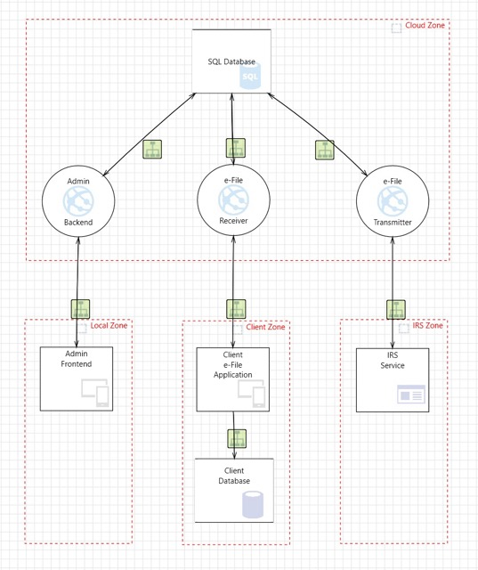
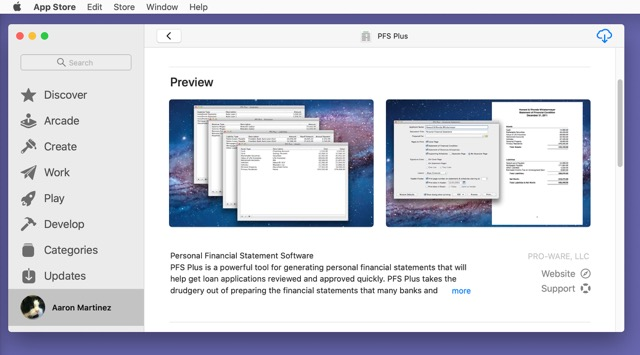
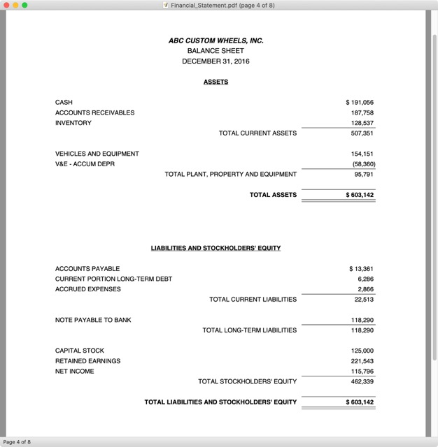
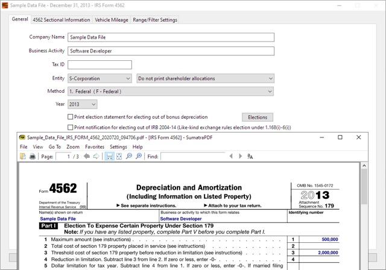
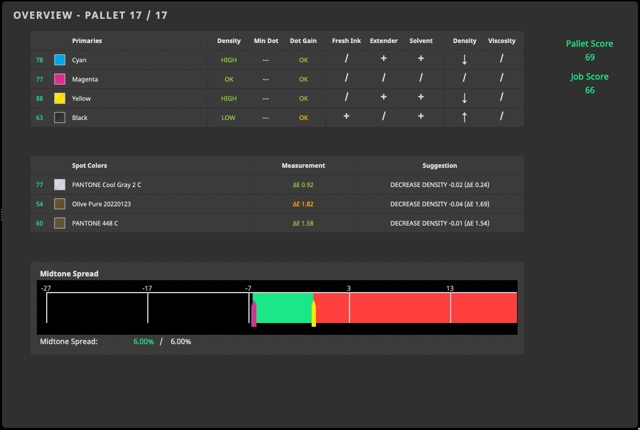
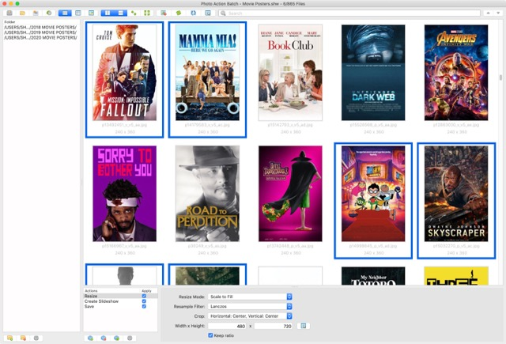
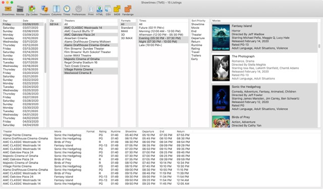

<!-- Title -->

# Aaron Martinez

Senior software development engineer experienced in system architecture design & implementation of robust, modular, & maintainable frameworks and applications that bridge the gap between abstract or complex business requirements & performant execution of software solutions for real-world production systems & resilient automated workflows.

***

<!-- Section (Category: Open Source) -->

## Open Source Software

<!-- Subsection -->

### Pza - Python Framework

Pza is a package that provides logging, settings, database, and command line features for Python apps.

- **Repository:** [GitHub](https://github.com/martinezcode/pza)

### TD Convert - Technical Document Conversion Tool

TD Convert is command line utility that converts technical document files between various formats.

- **Repository:** [GitHub](https://github.com/martinezcode/pza)

***

<!-- Section (Category: Professional) -->

## Professional Software Development

<!-- Subsection (Project) -->

### ACA 1095 Reporting

The Affordable Care Act (ACA) requires large employers and insurance providers to report health coverage information to the IRS annually. ACA 1095 Reporting desktop software and e-File service makes the process of gathering data and filing forms easy. Sophisticated data validation and strong security controls ensure that information returns are filed with the IRS accurately and safely.

- **My Role:** Product Owner / Lead Architect / Lead Engineer
- **Publisher Website:** [Pro-Ware](https://www.proware-cpa.com/aca-features.html)

<!-- Subsection (Project) -->

### PFS Plus

PFS Plus desktop software generates personal financial statements to help get loan applications reviewed and approved quickly.

- **My Role:** Lead Developer
- **Publisher Website:** [Pro-Ware](https://www.proware-cpa.com/pfsmc-features.html)

<!-- Subsection (Project) -->

### Quick Trial Balance - Financial Statements

Quick Trial Balance Pro assists in keeping general ledger accounts in balance through journal entries and a visual trial balance. With custom financial statements, year-to-year data, and ratio analysis features, Quick Trial Balance simplifies tax return and corporate financial statement preparation.

- **My Role:** Feature Developer
- **Publisher Website:** [Pro-Ware](https://www.proware-cpa.com/qtb-features.html)

<!-- Subsection (Project) -->

### Asset Keeper Pro - Tax Calculations, IRS Forms, Custom Reports

Asset Keeper Pro desktop software makes it easy for CPAs and other tax professionals to calculate and report asset depreciation and related business expense information for tax and GAAP purposes. With a comprehensive calculation engine, automated completion of official IRS forms, and custom report features, Asset Keeper can handle any depreciation situation.

- **My Role:** Feature Developer
- **Publisher Website:** [Pro-Ware](https://www.proware-cpa.com/ak-depreciation-info.html)

<!-- Subsection (Project) -->

### ColorCert - Color Measurement Suite

ColorCert color management software streamlines color communication, ensures brand consistency, and provides quality control for printing and packaging.

- **My Role:** Senior Developer
- **Publisher Website:** [X-Rite Pantone](https://www.xrite.com/categories/formulation-and-quality-assurance-software/colorcert)

***

<!-- Section (Category: Personal Projects) -->

## Personal Software Projects

<!-- Subsection (Project) -->

### Photo Action Batch

Photo Action Batch desktop application simplifies image file management tasks such as resizing, cropping, and slideshow creation. With support for multiple projects, advanced folder scanning options, and unique image selection features, Photo Action Batch is useful for design and development scenarios such as bulk thumbnail creation or icon resizing.   ‍

- **My Role:** Solo Developer

<!-- Subsection (Project) -->

### Showtimes

Showtimes desktop application presents movie showtime listings for selected theaters. Using the Nielsen Gracenote entertainment data API with custom filter and sorting options, Showtimes helps find the right movie time for any location and time frame.

- **My Role:** Solo Developer

***
