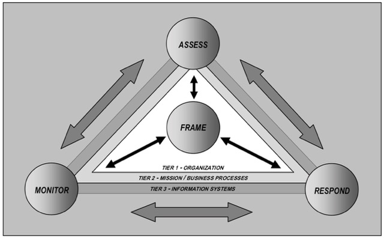
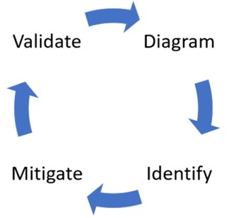
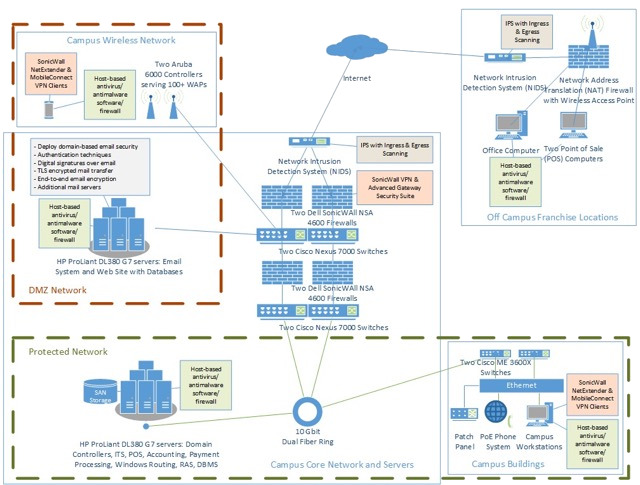
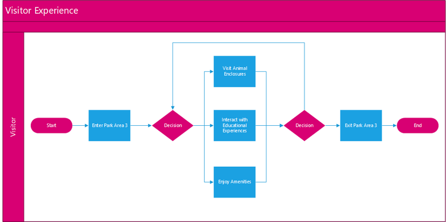

# Cybersecurity Architecture Resource Library

**By Aaron Martinez**

***

## Risk Assessment Frameworks

Foundational risk management methodologies are used to identify, evaluate, and prioritize organizational risks. By leveraging standardized NIST SP 800-30 protocols alongside custom project-based frameworks, these documents provide a repeatable structure for quantifying threats and formalizing mitigation strategies.

- [NIST Risk Assessment Framework (1 of 2) - Implementation Example](./docs/risk-assessment-framework-nist/nist-SP-800-30-risk-assessment-001-framework.md)
- [NIST Risk Assessment Framework (2 of 2) - Recommendations & Action Plan (Presentation)](./docs/risk-assessment-framework-nist/nist-SP-800-30-risk-assessment-002-presentation.pdf)
- [Project-Based Risk Assessment Framework (1 of 3) - Introduction](./docs/risk-assessment-framework-project/project-risk-assessment-001-framework.md)
- [Project-Based Risk Assessment Framework (2 of 3) - Risk Analysis Report](./docs/risk-assessment-framework-project/project-risk-assessment-002-analysis-report.md)
- [Project-Based Risk Assessment Framework (3 of 3) - Recommendations & Action Plan (Presentation)](./docs/risk-assessment-framework-project/project-risk-assessment-003-implementation-presentation.pdf)

***

## Threat Modeling Framework

Threat modeling is a proactive architectural practice used to anticipate and neutralize potential attack vectors before implementation begins and throughout a project life-cycle. These documents detail a comprehensive engagement process, from initial system analysis to a final remediation roadmap.

- [Threat Modeling Framework - Implementation Guide (1 of 3)](./docs/threat-modeling-framework/threat-modeling-framework-1-implementation.md)
- [Threat Modeling Framework - Engagement Report (2 of 3) - Threat Analysis Report](./docs/threat-modeling-framework/threat-modeling-framework-2-analysis-report.md)
- [Threat Modeling Framework - Engagement Report (3 of 3) - Recommendations & Action Plan](./docs/threat-modeling-framework/threat-modeling-framework-3-recommendations-report.md)

***

## System Security Architecture

Strategic design principles are necessary to build resilient, secure-by-design enterprise environments. These resources bridge the gap between operations and oversight, covering topics ranging from shifting cybersecurity left in the life cycle for early risk mitigation, to the core tenets of security management in the modern era.

- [Shift Left Proposal - Penetration Testing in the SDLC](./docs/architecture/shift-left-proposal.md)
- [Security Architecture - Assessment & Recommendations (Presentation)](./docs/architecture/design-presentation.pdf)
- [Core Competencies in Security Operations Management](./docs/architecture/operations-management.md)
- [Classical and Modern Security Management](./docs/architecture/security-management.md)
- [Turn an Idea into Reality with Project Management](./docs/architecture/project-management.md)

***

## Business Deliverables

Articulating technical debt, risk, and innovation roadmaps to non-technical stakeholders is critical for aligning infrastructure investment with long-term business strategy. These deliverables translate complex technical challenges into clear business insights.

- [Executive Summary - Migration Roadmap - IPv6 Challenges](./docs/deliverables/roadmap-ipv6-migration.md)
- [Executive Summary - VPN Business Impacts](./docs/deliverables/executive-summary-vpn.md)
- [Team Project - Network Architecture - Analysis & Recommendations (1 of 2) - Report](./docs/deliverables/infrastructure-001-recommendations.md)
- [Team Project - Network Architecture - Analysis & Recommendations (2 of 2) - Stakeholder Presentation](./docs/deliverables/infrastructure-002-presentation.pdf)
- [Theme Park Case Study (1 of 2) - Ethical Considerations](./docs/deliverables/park-001-ethical-considerations.md)
- [Theme Park Case Study (2 of 2) - Project Prototype](./docs/deliverables/park-002-prototype.md)

***

## More Resources Are Available Upon Request:

##### Security Plans & Policies

- Sample Physical Access Policy
- Supporting Security Policies and Programs
- Crisis Management Plan
- Disaster Recovery and Business Continuity

##### Incident Reports

- Preventable Cyberattacks
- Boeing Project Failure
- The F Bomb

##### Cybersecurity Research

- Law and Ethics
- Polygraph
- The Elicitation Dilemma
- The Age of Disinformation Part 1 - Senate Intelligence Committee Reports
- The Age of Disinformation Part 2 - Global Initiatives
- Update on the Quantum Initiative Act
- Summary and Analysis Revolutionary War Social Engineering
- Summary and Analysis Truman Era Social Engineering

##### Security Testing & Forensics

- Malware Reverse Engineering Presentation
- Ransomware Forensics
- Python and Nmap Presentation
- Penetration Testing Report
- Forensics Case Study
- Dirty COW Lab
- Linux Firewall Exploration Lab
- Shellshock Lab

***

<!--

##### Security Plans & Policies

- [Sample Physical Access Policy](./docs/plans/policy-physical.md)
- [Supporting Security Policies and Programs](./docs/plans/policy-supporting-programs.md)
- [Crisis Management Plan](./docs/plans/policy-crisis-plan.md)
- [Disaster Recovery and Business Continuity](./docs/plans/policy-continuity-plan.md)

##### Incident Reports

- [Preventable Cyberattacks](./docs/reports/preventable-cyberattacks.md)
- [Boeing Project Failure](./docs/reports/project-failure.md)
- [The F Bomb](./docs/reports/facebook-breach.md)

##### Cybersecurity Research

- [Law and Ethics](./docs/research/law-and-ethics.md)
- [Polygraph](./docs/research/polygraph.md)
- [The Elicitation Dilemma](./docs/research/elicitation-dilemma.md)
- [The Age of Disinformation Part 1 - Senate Intelligence Committee Reports](./docs/research/disinformation-001.md)
- [The Age of Disinformation Part 2 - Global Initiatives](./docs/research/disinformation-002.md)
- [Update on the Quantum Initiative Act](./docs/research/quantum.md)
- [Summary and Analysis Revolutionary War Social Engineering](./docs/research/social-engineering-revolution.md)
- [Summary and Analysis Truman Era Social Engineering](./docs/research/social-engineering-truman.md)

##### Security Testing & Forensics

- [Malware Reverse Engineering Presentation](./docs/lab/malware-presentation.md)
- [Ransomware Forensics](./docs/lab/ransomware-forensics.md)
- [Python and Nmap Presentation](./docs/lab/name.md)
- [Penetration Testing Report](./docs/lab/pentesting.md)
- [Forensics Case Study](./docs/lab/forensics.md)
- [Dirty COW Lab](./docs/lab/exploit-001-dirty-cow.md)
- [Linux Firewall Exploration Lab](./docs/lab/exploit-002-firewall.md)
- [Shellshock Lab](./docs/lab/exploit-003-shellshock.md)

-->
