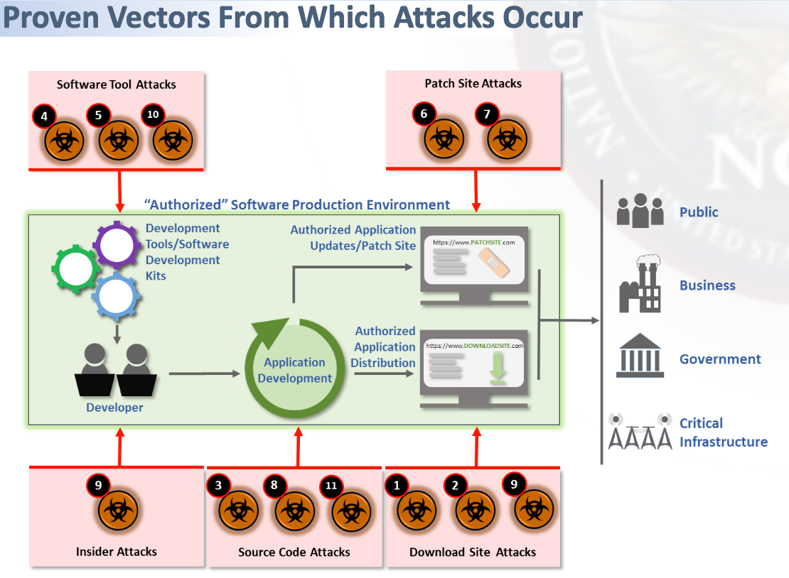
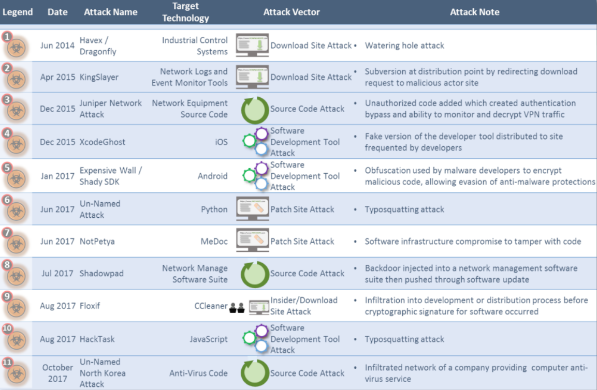
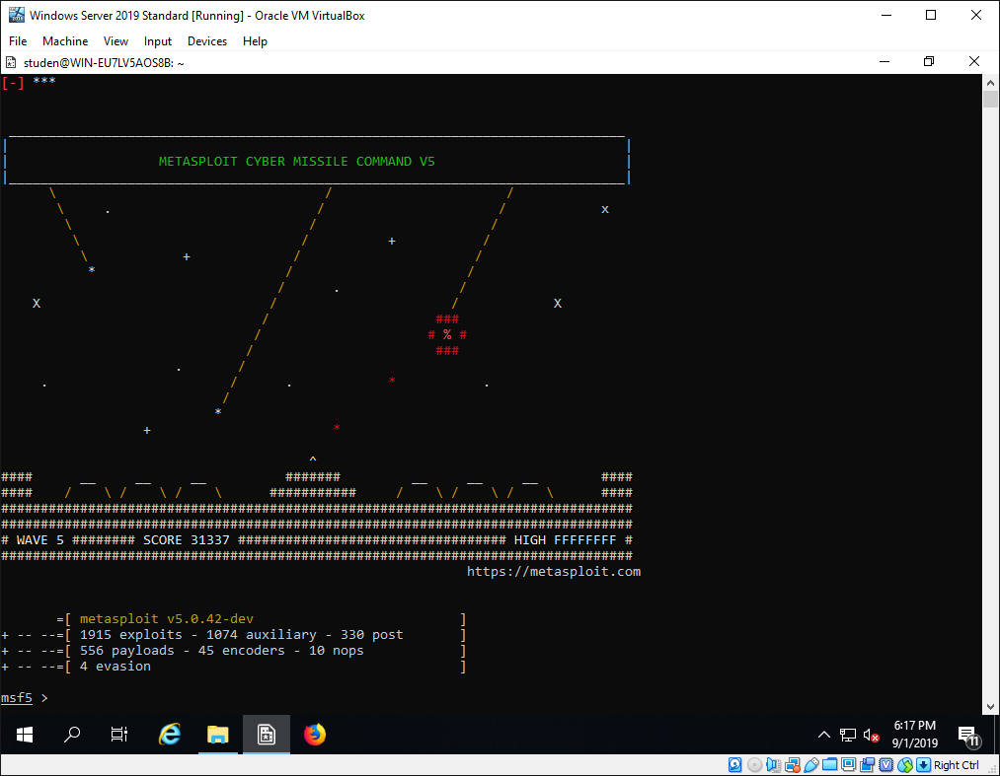
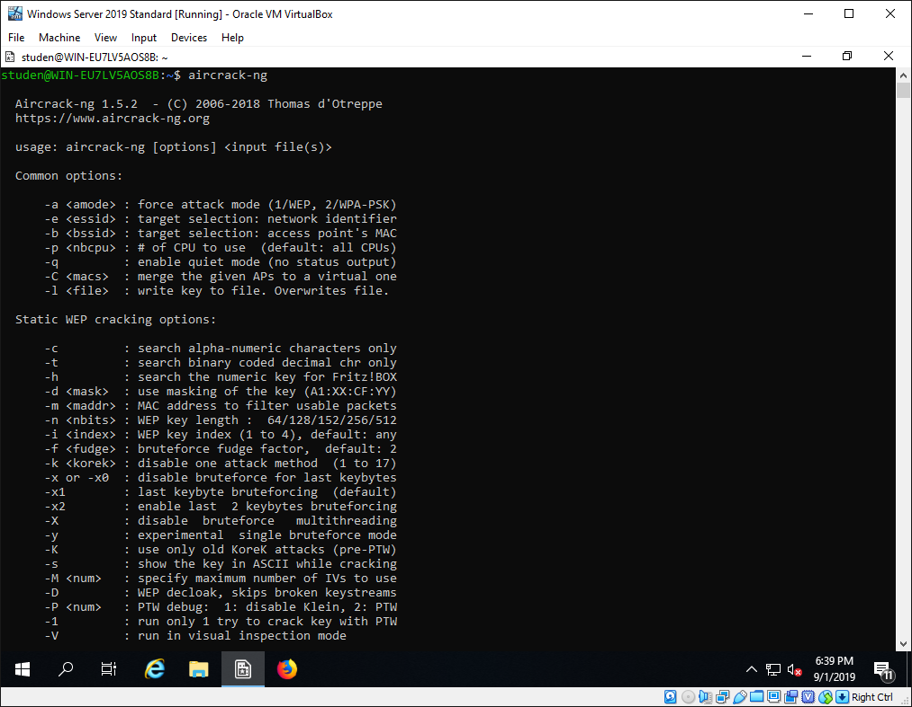
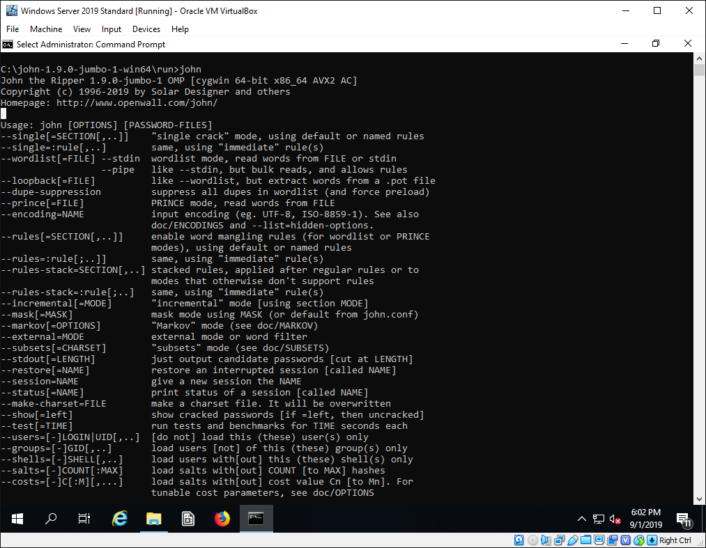
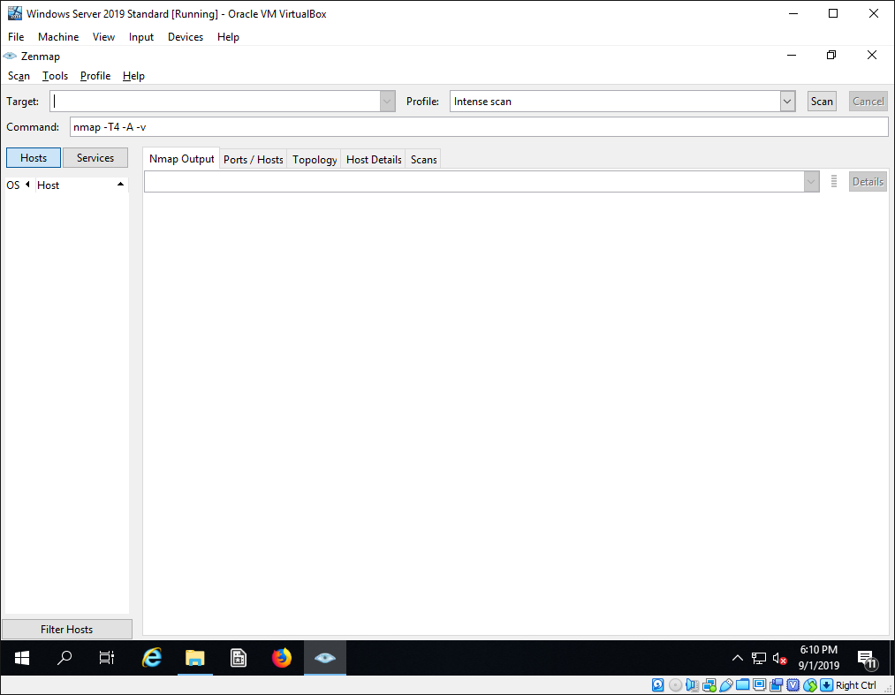
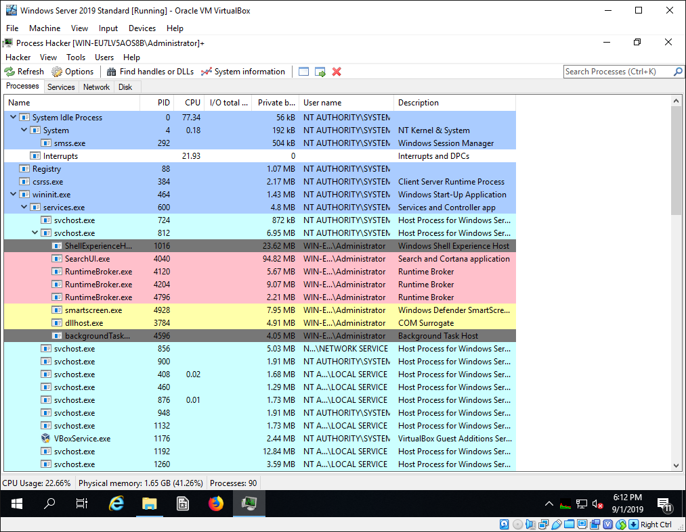
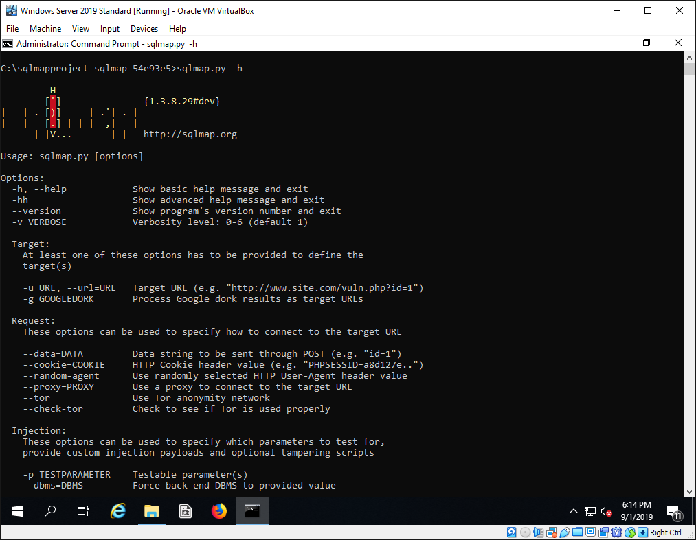
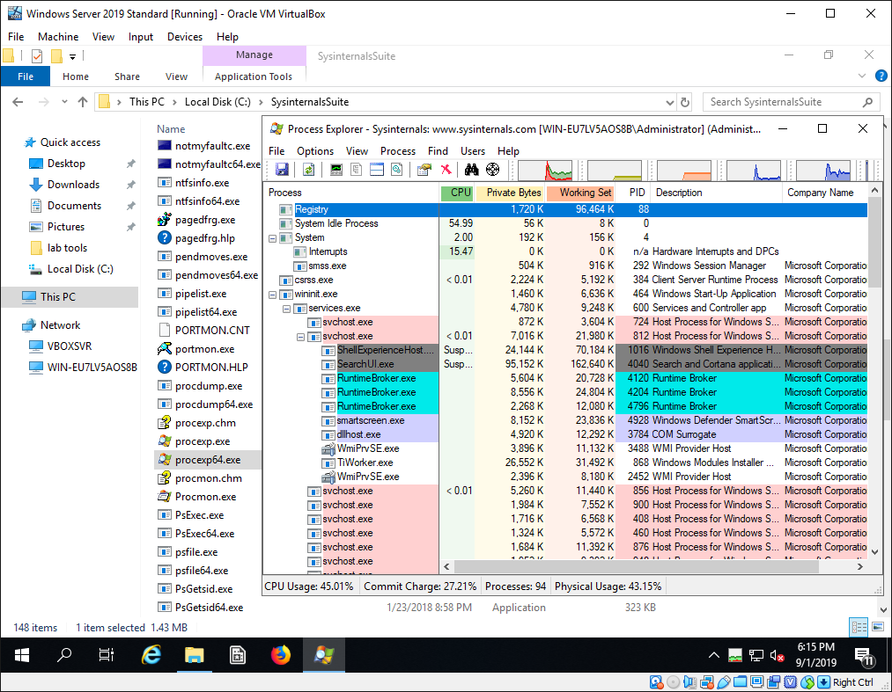
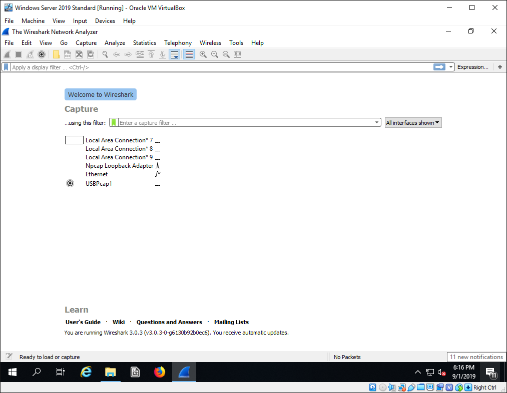

<!-- Header (Start) -->

# Shifting Left in Software Development Cybersecurity

## Integrating Penetration Testing Methodologies into the Software Development Life Cycle

<!-- Header (End) -->

<!-- Body (Start) -->

**Abstract**

The compartmentalization of roles between Software Development, Information Security (IS), and Information Technology (IT) departments can lead to security vulnerabilities being introduced or overlooked. The goals of software developers, security analysts, and system administrators can become misaligned, which may lead to lapses in security. Furthermore, software supply-chains are obvious targets for skilled attackers. Numerous high-profile data exfiltration, extortion, manipulation, and destruction campaigns have been successfully carried out through software supply chain attacks in recent years. To guard against cyberattacks, developers should incorporate penetration testing into their software development life cycle (SDLC). By probing their own designs, code, and applications for vulnerabilities at various stages of the engineering process, software developers can make significant contributions to organizational security. Formation of an atmosphere of mutual advice and collaboration between Development, IT, & IS teams will set an example for other departments and improve the overall security posture of the organization. By integrating ethical hacking into the SDLC, software developers can play a critical role in security assessment and create products that further business missions, build trust with end-users, and reduce the likelihood of major security breaches resulting from software vulnerabilities.

Traditionally, dedicated Information Security (IS) or Information Technology (IT) departments have been responsible for cybersecurity in many organizations. The role of software developers in these environments is to analyze technical problems and deliver solutions based on functionality requirements. This role is bolstered by developers\' expertise in design and coding, but lack of formal training or education in security-related issues.

This compartmentalization of roles into restrictive departments can lead to security vulnerabilities being introduced or overlooked. The goals of security analysts, system administrators, and software developers can become misaligned, which may lead to animosity between groups or even cause lapses in security.

Furthermore, software supply-chains are obvious targets for skilled attackers. Numerous high-profile data exfiltration, extortion, manipulation, and destruction campaigns have been successfully carried out through software supply chain attacks in recent years (NCSC, 2017). Figure 1 and Figure 2 illustrate a wide variety of attack vectors that have proven to be exploitable.

***

***

***

Developer involvement in matters of security is needed to guard against these threats. However, simply training developers on organizational policies and best practices for application design and implementation may not be enough to significantly improve security. Even the most well-prepared software developers can miss critical criteria or leave unintended bugs in code. Sophisticated attackers can identify these flaws and exploit them for nefarious purposes.

To guard against cyberattacks, developers should incorporate penetration testing into their software development life cycle (SDLC). By probing their own designs, code, and applications for vulnerabilities at various stages of the engineering process, software developers can make significant contributions to organizational security. Using the same tools and techniques employed by attackers, developers can become Ethical Hackers who find flaws *before* attacks occur, thereby reducing the likelihood of major security breaches resulting from software vulnerabilities.

## Proposed Penetration Testing Methodology

Clarification of the term *hacking* is warranted. To be clear, ethical hacking emulates the actions of malicious attackers, but is performed only with authorization and within the bounds of legal requirements and regulations. In practice, ethical hacking is penetration testing as an aspect of an organization\'s overall security strategy. As described by Duffy (2016), the overarching information security program is focused on \"maintaining the confidentiality, integrity, and availability of the organization\'s critical data and resources,\" while penetration testing is the practice of assessing that strategy\'s ability to protect critical data from malicious actions. The overall goal is to \"mitigate risk to an acceptable level by using a combination of people, processes, and technology" (Duffy, 2016).

To that end, Duffy (2016) recommended following a methodology such as the *Penetration Testing Execution Standard* (PTES), which provides an outline for a standardized penetration testing process consisting of seven phases:

- Pre-engagement Interactions
- Intelligence Gathering
- Threat Modeling
- Vulnerability Analysis
- Exploitation
- Post-Exploitation
- Reporting

Using a methodology provides the ability to evaluate an environment holistically and consistently with lower likelihood of missing large vulnerabilities (Duffy, 2016). PTES may be used as a starting point and customized to organizational needs or scenario requirements.

**Penetration Testing Tools**

Advanced hacking tools enable full-scale attacks across a spectrum of footprinting, network scanning, resource enumeration, gaining access, escalating privileges, pilfering, covering tracks, creating backdoors, and denial of service (DOS) (Tutănescu & Sofron, 2003). Many such tools are available for free on the Internet and can even be included as \"built-in\" tools with computer operating systems (OSs). Malicious attackers can deploy these tools against software development processes, but ethical hackers can also leverage exploit development, password cracking, and forensic software to identify vulnerabilities. Gaining familiarity with these tools and applying them in hands-on penetration exercises prepares software teams for attacks, reduces vulnerabilities in end-products, aids in identifying signs of potential compromises, and empowers developers with forensic investigation capabilities.

For example, the Kali Linux OS is branded for \"Offensive Security\", and may be installed on a computer, virtual machine, or portable drive for penetration testing purposes. This distribution of Linux makes a variety of tools readily accessible, including several highlighted by Verma (2019):

- *Metasploit Framework (MSF)*: A collection of tools including commercial grade exploits, an exploit development environment, network reconnaissance tools, and web vulnerability plugins.
- *Aircrack-ng*: Wi-Fi cracking tool for recovery of 802.11 WEP and WPA/WPA2-PSK keys.
- *Nikto*: Perl based web server vulnerability scanner with support for SSL, proxies, host authentication, and IDS evasion.
- *Bulk Extractor*: C++ program that scans disks and extracts useful information for automated inspection, parsing, and processing.

***

***

***

Additional Windows native versions of penetration testing tools are available as free downloads from a variety of vendor and developer sites, including: John the Ripper, Metasploit, Nmap/Zenmap, Ophcrack, Process Hacker, sqlmap, the Sysinternals Suite, and Wireshark.

- *John the Ripper*: Cross-platform password cracker to detect weak Unix passwords and hundreds of additional hashes and ciphers.
- *Nmap/Zenmap*: Network discovery and security auditing tool.
- *Ophcrack*: Windows password cracker with efficient rainbow table implementation and cross-platform GUI.
- *Process Hacker*: Multi-purpose tool for monitoring system resources, software debugging, and malware detection.
- *sqlmap*: Penetration testing tool to automate detection and exploitation of SQL injection flaws and database server takeover.
- *Sysinternals Suite*: Collection of system utilities for monitoring and configuring file and disk I/O, networking, processes, system information, and security.
- *Wireshark*: Network protocol analyzer for deep inspection of hundreds of protocols.

***

***

***

***

***

***

***

**Reverse Engineering**

Ethical hacking may also involve reverse engineering of the organization\'s own software, virus and malware specimens, or third-party tools where permitted by copyright and end-user license agreements (EULAs). Kamar and Alka (2017) recommended reverse engineering and vulnerability analysis through automated or manual systems. Using penetration testing tools to detect security breaches and vulnerabilities alongside reverse engineering tools to find attacker footprints aids in secure system development, enhances forensic investigations, and improves overall cybersecurity posture.

With access to source code, tools such as Sniff, TogetherJava, and RationalRose can generate UML diagrams, package diagrams, sequence diagrams, or allow browsing of source code at various levels of abstraction, according to Kamar & Alka (2017). Other tools enable cross-referencing information, generate graphical representations of methods and classes, or extract comments from source code. Without the source code, disassemblers can be used to convert binary executables to human read-able forms, and debuggers enable hooking and interaction with running programs for analysis (Zeltser, 2018). These resources enable software developers to understand the techniques adversaries might use to conduct reconnaissance, crack activation and authentication methods, or infiltrate software update mechanisms.

Zeltser (2018) suggested using behavioral analysis in addition to code analysis. Executing of programs in an isolated laboratory system allows interaction and observation of system, registry, and network activity (Zeltser, 2018). Virtual machines are useful for testing with convenient snapshot capabilities, but tools such as dd and Norton Ghost can mimic snapshot functionality with disk image cloning (Zeltser, 2018). Other tools recommended by Zeltser (2018) include:

- *Regshot* - Registry snapshot tool
- *Sysinternals* Process Monitor - Records API calls and local activities
- *CaptureBAT* - Process interaction logging
- *Wireshark* - Network traffic sniffing
- *Fakenet* - Provides web services for malware to connect to such as HTTP and SMTP

Immunity Debugger is another powerful tool for analysis of a running program. According to the tool's creators at Immunity Inc (2019), the advanced debugger includes GUI and command line interfaces capable of attaching to processes of interest by PID, process name, process services, listening TCP/UDP ports, binary name, and window name. The tool is promised to be lightweight with minimal usage of system resource but can be extended with connectivity to fuzzers and exploit development tools such as Metasploit. Immunity Debugger is Python-oriented, with an API, interpreter, and scripting engine included to enable advanced features. Advanced debugging tools provide insight into the processes used by attackers to footprint applications with CPU instruction and system memory analysis and develop exploits targeted at software vulnerabilities like race conditions or buffer overflows.

**Penetration Testing in the SDLC**

For the software development team with less experience in security testing, approaching security from a design and implementation perspective is beneficial. With engineering-oriented inclinations, developers are understandably focused on creating software with testing considered a necessary but less interesting phase of their process. However, developers should be encouraged to create secure software and incorporate penetration testing into the software development life cycle (SDLC), in line with *The 7 Qualities of Highly Secure Software* identified by Paul (2012):

- Security is built-in, not bolted on
- Functionality maps to a security plan
- Includes foundational assurance elements
- Is balanced
- Incorporates security requirements
- Is developed collaboratively
- Is adaptable

To meet the more niche needs of software development, van Wyk (2013) recommended adapting traditional penetration testing methods. The author made a distinction between typical software testing and penetration testing:

> *At its core, however, penetration testing should be employed to stress test the security aspects of a software system. That is, other testing processes are intended to identify the stress points, whereas penetration testing should ideally exercise those stress points for signs of breakability. (van Wyk, 2013)*

Some of the common pitfalls to avoid when incorporating penetration testing into the SDLC were noted by van Wyk (2013):

- Placing too late in the life cycle
- Lacking business risk perspective
- Checklist of repairs approach
- Failure to integrate with existing bug tracking
- Limited test coverage
- Outside - in methodology

To counter these pitfalls, penetration testing should be \"started at as early a stage as possible in the development life-cycle process\" with a white box approach allowing testers \"full access to all available development artifacts, including requirements, specifications, design, source code, and deployment specifications (van Wyk, 2013). Specific report documentation of issues should be tailored to the SDLC as well. Instead of providing a checklist of repairs, testing documentation should weigh the issues with \"regards to the specific needs of the application\" (van Wyk, 2013). Other recommendations from van Wyk (2013) include:

- The test team should be multidisciplinary to balance information security team knowledge of attack techniques and software development team expertise in the programming languages and frameworks used.
- Risk-based prioritization should guide the penetration testing team so that the highest risk areas of the application receive the most attention in planning and execution.
- Tools should provide launch points for further probing. Off-the-shelf tools for penetration testing will be limited, so custom written and/or tailored tools are needed.
- Human judgement calls are essential so the test team should have a thorough understanding of how the application works across all components.
- Interpretation of results should provide additional validation or elimination of risks including issues such as ease of exploit, time required, preconditions required, symptoms displayed, and ability to detect.

To avoid the common mistake of testing too late in the SDLC, Bryant (2019) emphasized the concept of \"pushing left\":

> *Pushing left \[is\] moving the introduction of security activities from the end of the project phases (verify, release, etc.) to the beginning phases (plan, design, etc.), ensuring that each phase has a list of security activities embedded within, promoting the likelihood of a secure software release. (Bryant, 2019)*

Organizations are likely to have their own implementation of the SDLC, but most models include a variation of the core phases: Plan, Design, Implement, Verify, Release, and Respond (Bryant, 2019). Rather than wait until late application development phases, the team should shift left and incorporate ethical hacking early and throughout the process.

According to Bryant (2019), the Systems Sciences Institute at IBM reported that the cost to fix a bug found during implementation was around six times costlier than one identified during design and bugs found during the testing phase could be 15 times costlier than during the design phase. The cost-justification curve shown in Figure 11 illustrates the effect of delaying security assessments.

***

***

Keeping down the cost of security-related bug-fixes requires realignment of the SDLC. In addition to penetration testing, other security activities can be inserted into the engineering phases. Figure 12 highlights several activities such as training, response planning, threat detection, and other valuable additions to the SDLC.

***

***

These activities are not all necessary for every organization or each project, but the table in Figure 12 provides a framework for activities that can be considered for inclusion. Taking on too much all at once should be avoided. Bryant (2019) provided guidance for making the paradigm shift:

- Start small and create an environment that will lead to a successful proof of concept
- Find a small program or new functionality that needs to be added to an existing program
- It is not essential to have multiple security activities built into each phase from the beginning
- Try to incorporate one activity per phase
- Assembling a team of innovators primarily tasked with proof of concept is key in pushing the organization left
- Once a successful proof of concept is delivered, early majority and late majority groups will come on board
- Start with small wins when trying to change the culture

## Recent Trends

The SDLC has long been equated with the traditional *waterfall* methodology of software development, which uses a series of phases that flow into each other as products are created. However, other methods have evolved and gained popularity in recent years, such as *agile*, with more incremental principles, and *DevOps*, where automation and collaboration between departments are emphasized (Laurent, 2018).

For teams working off the waterfall model, specific security testing phases with dedicated teams make sense, but more dynamic approaches are needed for groups working within agile or DevOps environments. Testers under these frameworks should be broken out of siloes and integrated amongst development teams and business stakeholder groups (Laurent, 2018). With these rapid and iterative development frameworks, ethical hacking can even be incorporated down to the *feature* level, with turnaround times from idea to production release occurring within hours or even minutes, as suggested by Schleen (2017) in Figure 13.

***

***

## Conclusion

This overview of ethical hacking in software development is necessarily broad, to remain accessible to organizations and engineering teams from a wide variety of backgrounds. Any new security program must be customized to the requirements and risks specific to the organization. Incorporation of ethical hacking into software development should be a forward-looking and iterative process. Over time, the security program will mature, and processes can become more streamlined or automated. If these security programs are successful, developers will become more familiar with security protocols, and security administrators will gain an understanding of the development processes. As pointed out by Bryant (2019), a cooperative environment benefits the organization as a whole:

> *Establishing and fostering a collaborative relationship between developers and security practitioners is an essential culture shift that enables success. When these two integral components of the organization work together, it enables progress and attainment of the overall goal: releasing more secure software. (Bryant, 2019)*

Formation of an atmosphere of mutual advice and collaboration between IT, IS, & Engineering teams will set an example for other departments and improve the overall security posture of the organization. By integrating ethical hacking into the SDLC, software developers can play a critical role in vulnerability and risk assessment and create secure products that further business missions and build trust with end-users.

# References

Damele, B., Guimaraes, A., & Stampar, M. (2019). SQLmap. Retrieved from SQLmap: http://sqlmap.org/

Bryant, K. (2019). The Art of Pushing Left in Application Security. ISSA Journal, 17(1), 31--34. Retrieved from http://search.ebscohost.com.ezproxy.bellevue.edu/login.aspx?direct=true&db=tsh&AN=133951376&site=eds-live

Duffy, C. (2016). Python: Penetration Testing for Developers. Birmingham, UK: Packt Publishing. Retrieved from http://search.ebscohost.com.ezproxy.bellevue.edu/login.aspx?direct=true&db=nlebk&AN=1402481&site=eds-live

Immunity Inc. (2019). Immunity Debugger. Retrieved from https://www.immunityinc.com/products/debugger/

Kumar, M., & Alka. (2017). Reverse Engineering and Vulnerability Analysis in Cyber Security. International Journal of Advanced Research in Computer Science. Retrieved from https://www.ijarcs.info/index.php/Ijarcs/article/viewFile/3502/3456

Laurent. (2018, August 29). Being tester in an agile or DevOps team. Retrieved from https://hiptest.com/blog/uncategorized/being-tester-in-an-agile-or-devops-team/

Liu, W. J. (2017). Process Hacker. Retrieved from https://processhacker.sourceforge.io/

Microsoft Sysinternals. (2017). Sysinternals Utilities Index. Retrieved from https://docs.microsoft.com/en-us/sysinternals/downloads/

NCSC. (2017, October 30). Software Supply Chain Attacks Placemat. US National Counterintelligence and Security Center. Software and Supply Chain Assurance Winter Forum 2017. Retrieved from https://csrc.nist.gov/CSRC/media/Projects/Supply-Chain-Risk-Management/documents/ssca/2017-winter/NCSC_Placemat.pdf

Nmap. (2019). Nmap. Retrieved from https://nmap.org/

Openwall. (2018). John the Ripper. Retrieved from https://www.openwall.com/john/#contrib

Ophcrack. (2019). Ophcrack. Retrieved from http://ophcrack.sourceforge.net/

Paul, M. (2012). The 7 Qualities of Highly Secure Software. Boca Raton, FL: Auerbach Publications. Retrieved from https://search-ebscohost-com.ezproxy.bellevue.edu/login.aspx?direct=true&db=edsebk&AN=465644&site=eds-live

Port Swigger. (2019). Burp Suite Editions. Retrieved from https://portswigger.net/burp

Schleen, D. J. (2017, October 10). Automating Security in DevOps Pipelines. SANS Secure DevOps Summit and Training. Aetna. Retrieved from https://www.sans.org/cyber-security-summit/archives/file/summit-archive-1510001518.pdf

Tutănescu, I., & Sofron, E. (2003). Anatomy and Types of Attacks Against Computer Networks. RoEduNet International Conference. Retrieved from http://el.el.obs.utcluj.ro/roedunet2003/site/conference/papers/TUTANESCU_I-Anatomy_and_Types_of_Attacks_against_Computer\_..pdf

van Wyk, K. (2013, May 21). Adapting Penetration Testing for Software Development Purposes. Carnegie Mellon University. Retrieved from https://www.us-cert.gov/bsi/articles/best-practices/security-testing/adapting-penetration-testing-software-development-purposes

Verma, A. (2019, May 17). 9 Best Kali Linux Tools for Hacking and Penetration Testing in 2019. Retrieved from Fossbytes: https://fossbytes.com/best-kali-linux-tools-hacking/

VirtualBox. (2019). Download VirtualBox. Retrieved from https://www.virtualbox.org/wiki/Downloads

Wireshark. (2019). Wireshark. Retrieved from https://www.wireshark.org

Zeltser, L. (2018). Introduction to Malware Analysis. Retrieved from https://zeltser.com/malware-analysis-webcast/

<!-- Body (End) -->

<!-- Footer (Start) -->

# Author

### Aaron Martinez

- GitHub: <https://github.com/martinezcode/>
- LinkedIn: <https://www.linkedin.com/in/martinezcode/>

<!-- Footer (End) -->

