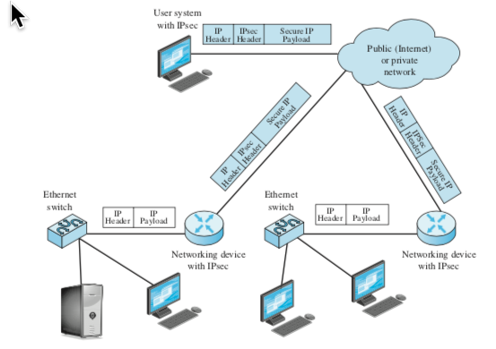

<!-- Header (Start) -->

# Virtual Private Networking Technology - Business Impacts

## Executive Summary

<!-- Header (End) -->

<!-- Body (Start) -->

**Introduction**

Businesses today relay heavily on public networks, leased telecommunications lines, and subscribed wireless services. Offices are often connected through wide area networks (WANs) that join local area networks (LANs) across great distances. Increasingly, companies are attracting talented and responsible employees by offering remote working positions that allow users to connect from home or through publicly available wireless internet (Wi-Fi) hotspots. In these instances, security and privacy can be enhanced by running connections through a virtual private network (VPN). As defined by Stallings and Case (2013), a VPN employs encryption and security protocols to allow secure communication to travel over relatively insecure networks, such as the Internet or other shared backbone facilities.

**VPN Technology Overview**

Secure communication is possible through VPNs that utilize traditional packet switching infrastructure as well as newer network technologies. As noted by Roşu and Drăgoi (2011), Frame Relay and Asynchronous Transfer Mode (ATM) virtual circuits have supported VPN provisioning for many years, and protocols and services such as Internet Protocol Security (IPsec), Point-to-Point Protocol over Layer 2 Tunneling Protocol (PPPoL2TP), Multiprotocol Label Switching (MPLS), and Universal Mobile Telecommunication System (UMTS) have emerged as popular alternatives. The availability of these services enables *site-to-site* VPNs that connect geographically dispersed sites and *remote access* VPNs that connect remote users to organization sites (Roşu & Drăgoi, 2011). The three primary implementation models for enterprise level VPN architectures are *host-to-host* between two devices, *host-to-gateway* between one or more individual devices to an organizational network, and *gateway-to-gateway* between two separate networks (Roşu & Drăgoi, 2011).

Stallings and Case (2013) highlight IPsec as one of the most transformative technologies in the popularization of VPN connections. IPsec is a set of standards for authentication and encryption designed to be usable with current IPv4 protocols as well as more modern IPv6 (Stallings & Case, 2013). Interoperability with both IP protocol versions allows vendors to offer services now that will work for many years in the future. The key feature of IPsec lies in its ability to "encrypt and/or authenticate *all* traffic at the IP level" to securely support distributed applications, remote logon, client/server, email, file transfer, and many more services (Stallings & Case, 2013). Figure 1 illustrates how IPsec is applied in a typical scenario.

***

###### *Figure 1*. A typical IP security scenario (Stallings & Case, 2013).

***

**Business Impacts**

Businesses can take advantage of IPsec and other VPN services to allow private and secure communication that would not otherwise be protected over public or shared network infrastructure. Private voice and video communication, remote access to company resources, and secure data sharing are all possible in a cost-effective manner with reliable LAN integration and constant transfer rates when a VPN is used (Roşu & Drăgoi, 2011). Employing VPN technology at the enterprise level allows the entire organization to utilize the company's network services and applications securely.

Roşu and Drăgoi (2011) suggest this extending the advantages to a *virtual enterprise* (VE) approach that facilitates connections between allied organizations in fields such as automotive, agriculture, and food industry. By connecting geographically distributed organizations, VE allows businesses to form temporary alliances that "share resources and skills in order to respond better and faster to emerging opportunities in the market, based on a technical infrastructure and information technologies represented by communications/computer networks" (Roşu & Drăgoi, 2011). This approach allows member organizations to combine disparate core competencies in innovation capacity, processing capacity, and cooperation ability by forming temporary partnerships that collectively increase competitiveness and improve business responses on a global scale.

Without secure VPN connections, businesses would be vulnerable to a wide variety of threats. Known Wi-Fi connection exploits and high profile data breaches are raising public awareness are driving businesses to employ VPNs, as reported by Gargiulo (2018). As users become more mindful, employees and customers have higher expectations for security and privacy suggests Bourque (2017). With a VPN, users can feel secure when connecting connect from client locations, from home, or even when traveling. Another advantage arises from the VPNs functionality of replacing the users remote IP address with the private network's IP address, which facilitates connection to resources that might otherwise be blocked by a service provider (Bourque, 2017). By routing traffic through the virtual network, endpoint destinations see only the virtual network as the connection source, rather than the original IP addressed which may be blocked if it originates from overseas or another disallowed area.

**Conclusion**

Virtual private networks allow the secure communications that have become a necessity for all businesses and organizations. With VPN technology, businesses are able safely communicate while taking advantage of the latest applications and networking services. Using the most up to date services facilitates competitiveness and innovation in the ever-growing global economy. As new threats emerge and more personal and private information gathering is required, security is paramount. VPN connections are a proven cost-effective method for successful secure and private communication.

# References

Bourque, A. (2017, April 6). 5 ways your company can benefit from using a VPN. *Computerworld*. Retrieved from: https://www.computerworld.com/article/3184651/networking/5-ways-your-company-can-benefit-from-using-a-vpn.html.

Gargiulo, M. (2018, July 10). The Future of The VPN Market. *Forbes*. Retrieved from: https://www.forbes.com/sites/forbestechcouncil/2018/07/10/the-future-of-the-vpn-market.

Roşu, S. M., & Drăgoi, G. (2011). VPN Solutions and Network Monitoring to Support Virtual Teams Work in Virtual Enterprises. *Computer Science and Information Systems, Vol. 8, No. 1*. Retrieved from: https://doi.org/10.2298/CSIS100127033R.

Stallings, W. & Case, T. (2013). *Business Data Communications: Infrastructure, Networking and Security*. Boston: Pearson Education, Inc.

<!-- Body (End) -->

<!-- Footer (Start) -->

# Author

### Aaron Martinez

- GitHub: <https://github.com/martinezcode/>
- LinkedIn: <https://www.linkedin.com/in/martinezcode/>

<!-- Footer (End) -->