<!-- Header (Start) -->

# Dinosaur Theme Park

## Prototyping for Park Area 3

<!-- Header (End) -->

<!-- Body (Start) -->

**Park Area 3 - Visitor Storage Locker Rental - User Interface Prototype**

As a system architecture team leading the development of Park Area 3 with responsibility for the carnivorous dinosaurs, our goal is to provide amusement park services for an unparalleled customer experience. The team, along with the stakeholders involved in using the system, supporting the system, and paying for the system, understand that success requires consideration of the user experience for park visitors. In particular, IT-related aspects of the park must be designed with usability, accessibility, and inclusion considerations addressed at all stages of development.

## Locker Rental Kiosk

***

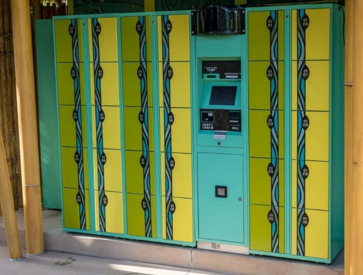

###### Figure 1. Locker rental kiosk for visitors to store items when entering Park Area 3 (Orlando Informer, 2012).

***

**Locker Rental Check-In Interaction**

***

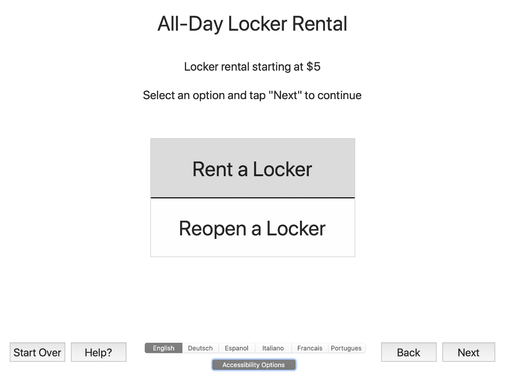

###### Figure 2. Screen for starting the initial rental or return user reopening processes.

***

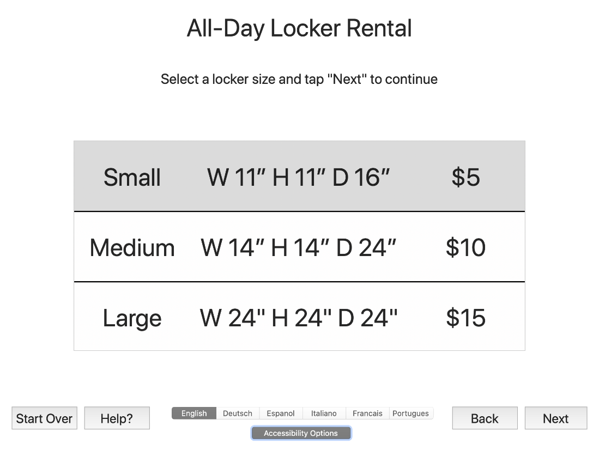

###### Figure 3. Locker size selection screen.

***

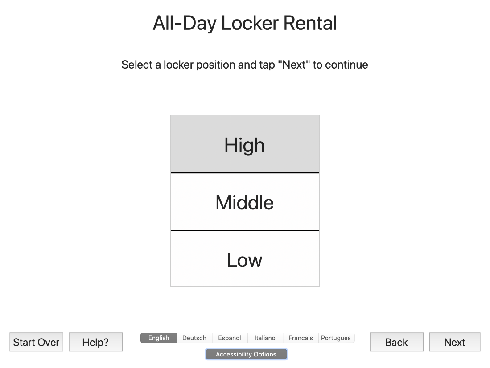

###### Figure 4. Locker vertical height accessibility selection screen.

***

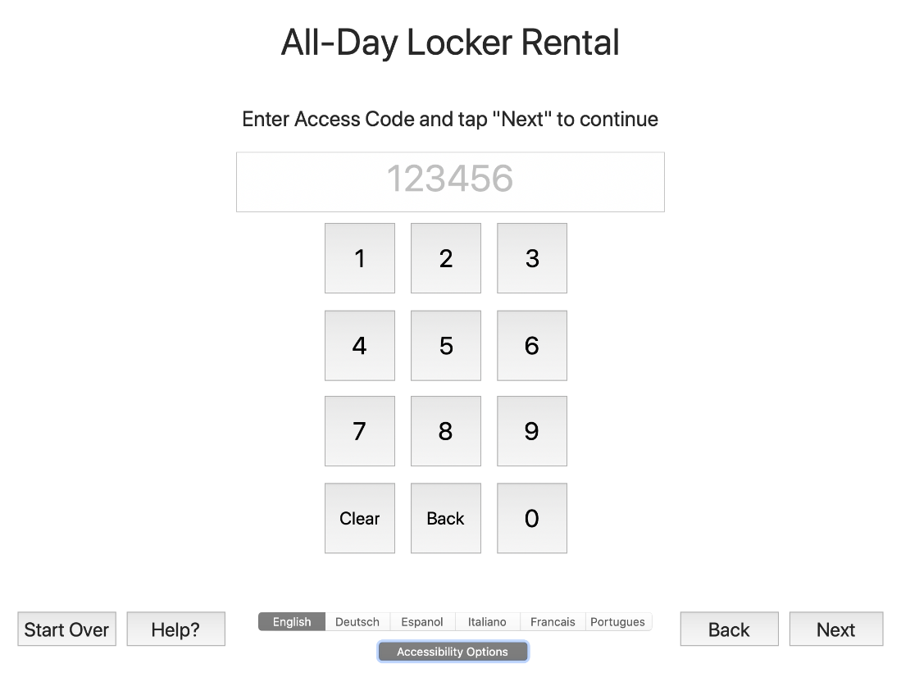

###### Figure 5. Locker rental user access code prompt screen.

***

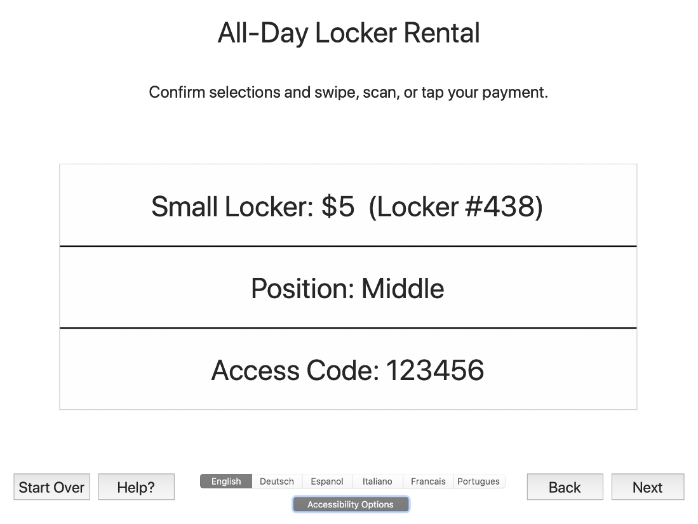

###### Figure 6. Locker selections confirmation and payment screen.

***

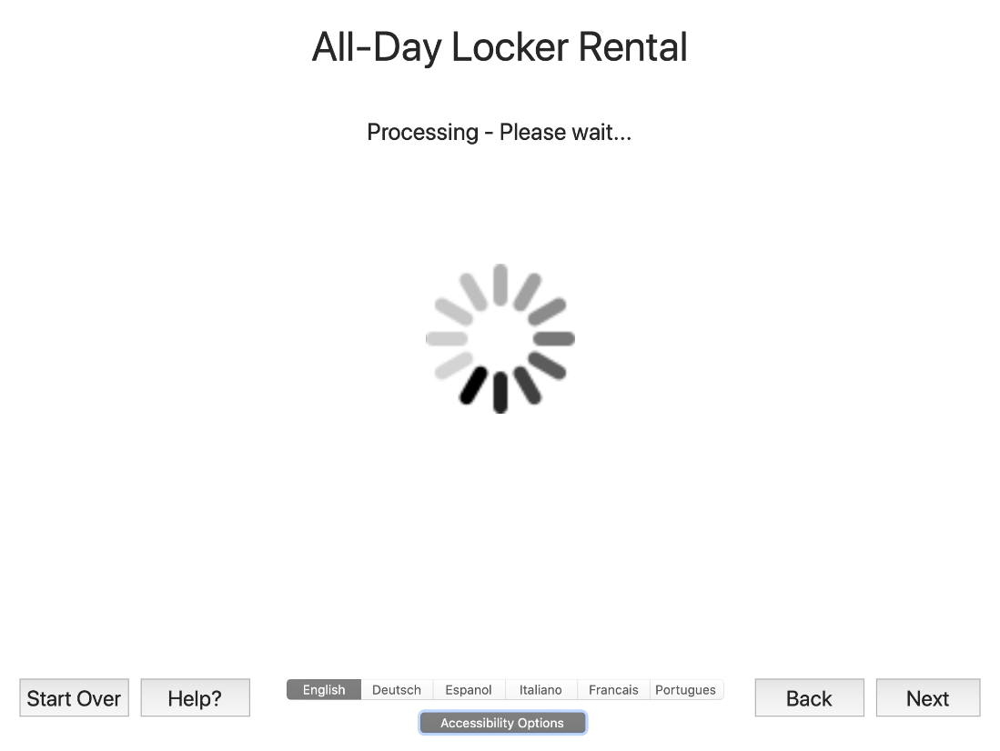

###### Figure 7. Payment processing screen.

***

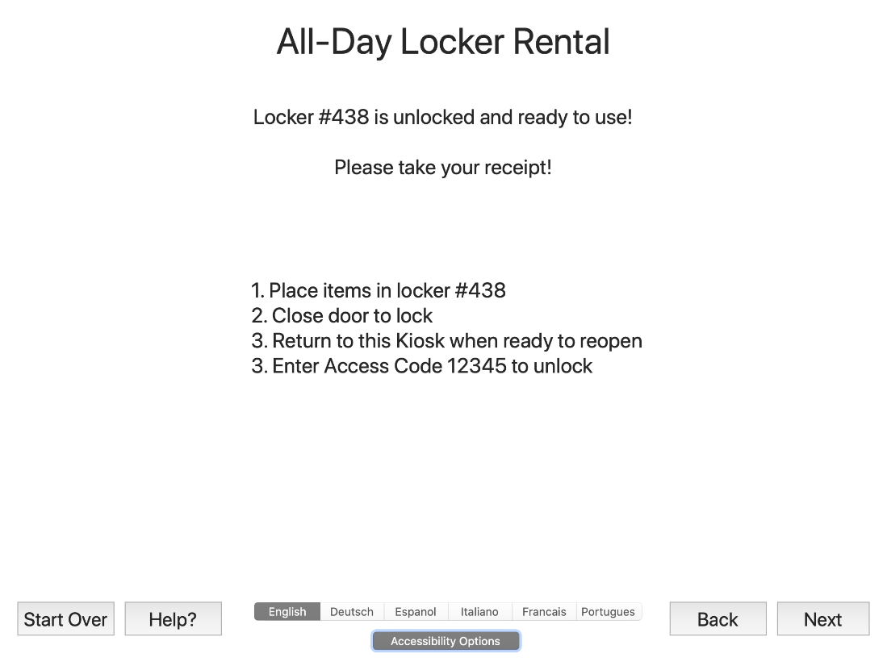

###### Figure 8. Final confirmation and user instructions screen.

***

## Locker Rental Check-Out Interaction

***

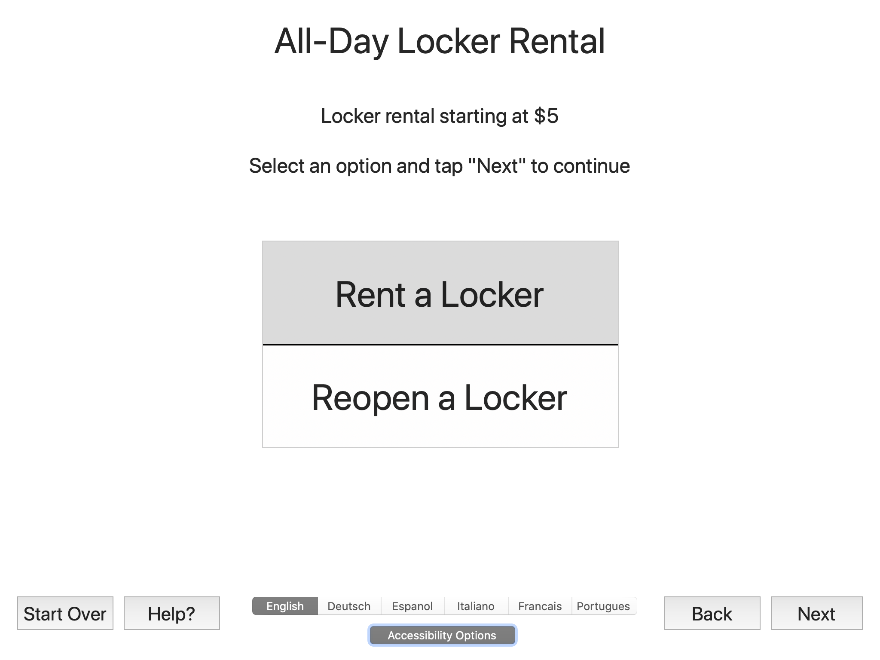

###### Figure 9. Initial screen where returning user can select to reopen a locker.

***

###### Figure 10. Returning user access code prompt.

***

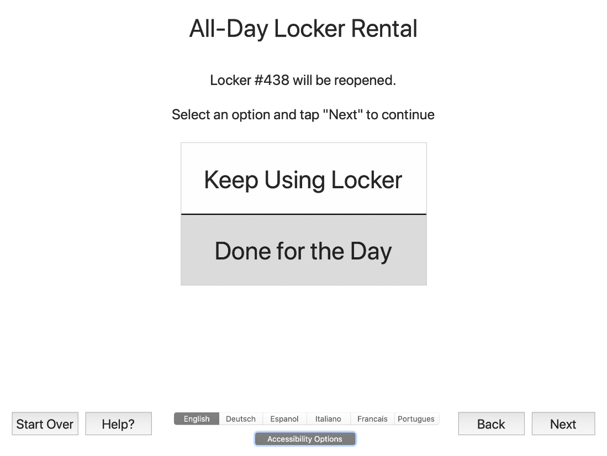

###### Figure 11. Option to end locker use or continue rental.

***

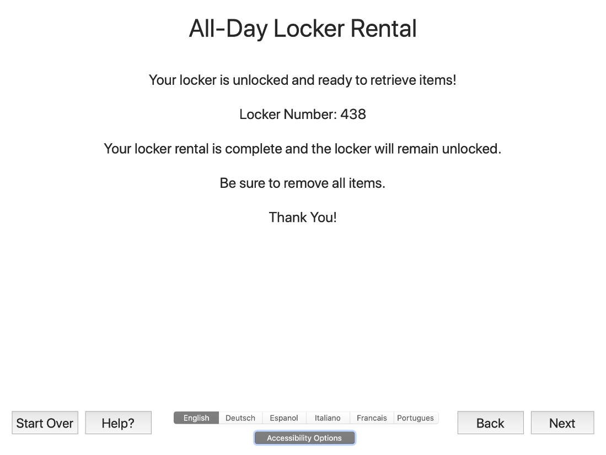

###### Figure 12. Final confirmation screen when ending locker rental.

***

## User Experience Testing Report

User experience testing of an initial version of the storage locker rental prototype application was conducted with a focus group of end-users. A diverse set of testers representative of the park visitor population interacted with the prototype application and feedback was collected through interviews. Issues noted during the feedback sessions were shared with the application developer and addressed through interface changes documented here:

- Language selection was moved to an interface element at the bottom of each screen instead of being a separate step in the interaction process.
- A \"Start Over\" button was added to allow users to return directly to the beginning of the process instead of clicking \"Back\" multiple times.
- A \"Help\" button was added to provide answers to frequently asked questions about options on the screen.
- A progress wheel was added to the payment processing screen to avoid giving an impression that the interface was frozen.

## User Experience Plan

Usability must be considered to ensure an appropriate level of \"effectiveness, efficiency, and satisfaction with which a specified set of users can achieve a specified set of tasks\" (University of Washington, 2020). To provide a usable experience, designers and developers should factor learnability, consistency, and efficiency into decisions by asking the following questions, as recommended by University of Washington (2020):

- *Learnability: Can users easily learn how to operate the product and remember how to perform tasks when they return to the product?*
- *Consistency: Are product features clearly and consistently labeled?*
- *Efficiency and effectiveness: Can users perform tasks with a minimal amount of effort and achieve their goals successfully?*

User experiences must avoid discriminatory aspects for people with disabilities by providing accessibility for all users. Every staff member and visitor should be able to understand and interact with user interfaces so that task may be completed efficiently and effectively. As suggested by W3C (2020), these concerns should be addressed by incorporating diversity into development practices:

- *Ensuring that everyone involved in projects understands the basics of how people with disabilities use the Web.*
- *Involving users with disabilities early and throughout the design process.*
- *Involving users in evaluating accessibility.*

Inclusion allows all users to feel welcome in the park, regardless of background or status. As W3C (2020) pointed out, designs should be *universal*, so all individuals are ensured involvement to the greatest extent possible, without being limited by issues such as:

- *disabilities*
- *computer literacy and skills*
- *economic situation*
- *education*
- *geographic location*
- *culture*
- *age*
- *language*

## Conclusion

Creators are encouraged to follow standards and techniques such as the Web Content Accessibility Guidelines (WCAG, ISO/IEC 40500). However, as acknowledged by WC3 (2020), these standards should not be adopted as simply a technical checklist. Rather, designers, developers, and project managers should maintain an emphasis on the human elements of user experience. Focusing on usability, accessibility, and inclusion will ensure that everyone enjoys an exceptional user experience throughout Park Area 3.

# References

Orlando Informer. (2012). Lockers at Universal Orlando -- a complete, up-to-date guide. Retrieved from https://orlandoinformer.com/universal/rental-ride-lockers

University of Washington. (2020). Access Computing - What is the difference between accessible, usable, and universal design? Retrieved from https://www.washington.edu/accesscomputing/what-difference-between-accessible-usable-and-universal-design

W3C. (2020). Accessibility, Usability, and Inclusion. https://www.w3.org/WAI/fundamentals/accessibility-usability-inclusion/

Xojo \[Computer software\]. (2020). Xojo Version 2019r3.1. Retrieved from https://www.xojo.com/download/

<!-- Body (End) -->

<!-- Footer (Start) -->

# Author

### Aaron Martinez

- GitHub: <https://github.com/martinezcode/>
- LinkedIn: <https://www.linkedin.com/in/martinezcode/>

<!-- Footer (End) -->