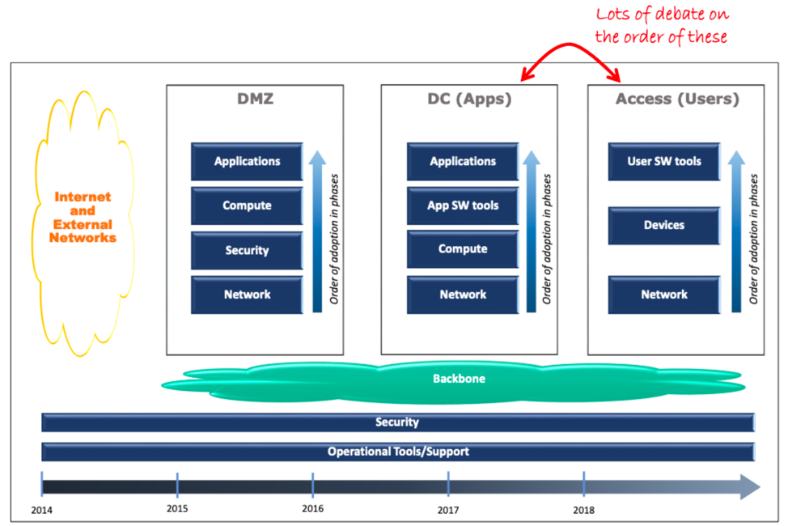

<!-- Header (Start) -->

# Migration Proposal - Internet Protocol Version 6

## Executive Summary

<!-- Header (End) -->

<!-- Body (Start) -->

**Introduction**

Internet Protocol version 6 (IPv6) is widely available, but IP version 4 (IPv4) remains in use. Nearly a decade after the National Institute of Standards and Technology (NIST) issued Special Publication (SP) 800-119, *Guidelines for the Secure Deployment of IPv6*, many organizations have yet to adopt the latest and greatest version of the standard protocol for networked communication. Examination of the motivations for implementation of IPv6, the differences from its predecessor, and an enterprise scale deployment case study, provides insight into current state of IPv6 adoption.

**The Need for IPv6**

IP is an important mechanism for the exchange of information over the Internet and other networks. As noted by Radack (2011), IP provides management of network addresses and defines the format for splitting data into manageable packets with header information containing sender, destination, and reassembly details. Due to limitations on available address sizes in IPv4, IPv6 was developed with a larger address space to mitigate the risk of running out of the addresses needed to meet future demand (Radack, 2011).

IPv6 also contains security enhancements to safeguard information as it traverses computer networks. IPv4 favored interoperability over security in its design, and thus did not originally support cryptographic methods that prevent eavesdropping, tampering, or unauthenticated network access (Radack, 2011). IPv6 better protects against these threats by supporting the IP Security (IPsec) suite of protocols to provide secure communications (Radack, 2011). Additional IPv6 enhancements listed by Radack (2011) include:

- Plug-and-play networking, or autoconfiguration, without the need for a server.

- Simpler header structure for improved and faster processing of packets.

- Extension options that promote improved processing and avoid some security problems.

- Mobile IPv6 (MIPv6) enhanced protocol supporting roaming for a mobile node to move from one network to another without losing connectivity.

- Quality of Service options that implement policy-based networking choices to prioritize the delivery of information.

- Hierarchal addressing structure and simplified header for improved routing of information from a source to a destination.

- Path Maximum Transmission Unit (PMTU) Discovery procedure eliminates the need for routers to perform fragmentation and provides for efficient transmission.

A full transition to IPv6 may be outside of the comfort zone for many organizations due to a lack of understanding of the benefits. It might seem like an unnecessary risk to switch over while IPv4 is still adequate. Holder (2017) suggested that primary blockers are: a do not fix what is not broken perception of IPv4, lack of budgets for IPv6 deployment, and loss of benefits from technology that works with IPv4, such as NAT44 for Network Address Translation from IPv4 to IPv4 addresses. However, some large enterprises, such as Microsoft and Wells Fargo, have had success rolling out the new protocol (NIST NCCoE, 2019).

**IPv6 Implementation Case Study**

John Burns of Wells Fargo shared his organization\'s experience with the IPv6 transition with NIST in a workshop aimed at evaluating existing security guidance and informing future recommendations (NIST NCCoE, 2019). Burns (2019) suggested that, despite public perception, IPv6 has additional benefits apart from the provision of new network addresses. In addition to providing more addresses, IPv6 supports other efforts, such as network hygiene and simplification, cybersecurity, segmentation, cloud adoption, and automation (Burns, 2019). The presenter offered a potential roadmap for large scale IPv6 deployment, shown in Figure 1. Burns (2019) suggested using a phased rollout but acknowledged an ongoing debate about the specific order. As security and operational tooling infrastructures transition to supporting IPv6, organizations can upgrade their networks, policies, and applications by beginning at the backend and gradually progressing toward the front-end user experience (Burns, 2019).

***

###### Figure 1. Sample roadmap for enterprise scale IPv6 deployment (Burns, 2019).

***

Burns (2019) identified areas where the rollout was \"almost painless,\" including IPv6 routing, standard load balancing, firewalling, DNS, dual stack outbound web proxy, and training. Still, the presenter noted the challenge of \"product and feature gaps\" as the protocol was adopted: \"Many niche products for enterprises lacked not onlyIPv6 support, but any credible roadmap to get there\" (Burns, 2019). Additional issues noted by Burns (2019) included:

- Missing network security features (RA-guard, ND-inspection, OSPFv3 MD5 auth, 802.1X DACLs)
- Remote access VPN products (surprisingly late to the game)
- Peer-to-peer content distribution issues
- Some endpoints support "split stack" (IPv4 OR IPv6, not both)
- Storage world lagging in v6 support
- Cloud stacks (public and private) have limited or non-existent v6 support
- RFC5952 text representation not well understood/adopted
- Active Directory and DHCP integration issues
- Discovery/scanning tools such as brute force sweeps and dual-stack address affinities are very challenged
- Troubleshooting dual stack complicates familiar techniques

**Overcoming the Challenges**

Burns (2019) indicated a lack of guidance and support that keeps full adoption of native IPv6 only technologies out of reach for the time being. The presenter called for improved guidance on valid IPv6 solutions, better support for features which remediate IPv4 deficiencies, and increased exposure of IPv6 capabilities that validate the updated version as the next generation protocol beyond the provision of bigger addresses (Burns, 2019).

For organizations considering or already implementing a move to IPv6, Radack (2011) provided additional advice, summarized from NIST SP 800-119:

- Encourage staff members to increase their knowledge of IPv6.

- Plan a phased IPv6 deployment utilizing appropriate transition mechanisms to support business needs.

- Do not deploy more transition mechanisms than necessary.

- Plan for a long transition period with the coexistence of dual systems supporting both IPv4 and IPv6.

- Apply an appropriate mix of different types of IPv6 addressing (privacy addressing, unique local addressing, sparse allocation, etc.) to limit access and knowledge of IPv6-addressed environments.

- Use automated address management tools to avoid error prone manual entry of long IPv6 addresses.

- Develop a granular ICMPv6 (Internet Control Message Protocol for IPv6) filtering policy for the enterprise.

- Use IPsec to authenticate and provide confidentiality to assets that can be tied to a scalable trust model

- Identify capabilities and weaknesses of network protection devices in an IPv6 environment.

- Enable controls that might not have been used in IPv4 due to a lower threat level during initial deployment.

- Pay close attention to the security aspects of transition mechanisms such as tunneling protocols.

- Ensure that IPv6 routers, packet filters, firewalls, and tunnel endpoints enforce multicast scope boundaries and make sure that Multicast Listener Discovery (MLD) packets are not inappropriately routable.

- Be aware that switching from an environment in which NAT provides IP addresses to unique global IPv6 addresses could cause a change in the definition of system boundaries.

**Conclusion**

Many organizations still face obstacles that stand in the way of full-scale IPv6 deployment. Lack of awareness of benefits and perception of the risks involved are psychological factors that influence the motivation, or lack thereof, for moving away from IPv4. Likewise, support for the updated protocol by software and hardware vendors is still lacking in many areas. However, NIST and others are working to improve guidance by working with enterprises who have gained real-world experience deploying the new technology. IPv6 adoption is likely to continue and increase significantly in the near future, so organizations should prepare for the changeover soon if efforts are not already underway. Organizations must consider their business and technology needs, and engage in a thorough planning process, but IPv6 capabilities are accessible to those wishing to transition to the new technology.

# References

Burns, J. (2019, June 13). Notes from a Large Enterprise on IPv6 Adoption. *NIST NCCoE Security for IPv6 Enabled Enterprises Workshop*. Wells Fargo. Retrieved from https://www.nccoe.nist.gov/events/security-ipv6-enabled-enterprises

EFY. (2019). Internet - Part 4 of 6: Communication And Internet Technology: from IPv4 to IPv6. *Electronics For You*. Retrieved from https://search-ebscohost-com.ezproxy.bellevue.edu/login.aspx?direct=true&db=edsbig&AN=edsbig.A592265290&site=eds-live

Holder, D. (2017, June 7). *Blockers to IPv6 Adoption*. Retrieved from https://labs.ripe.net/Members/david_holder/blockers-to-ipv6-adoption

NIST. (2010, December 29). Guidelines for the Secure Deployment of IPv6. Retrieved from https://www.nist.gov/publications/guidelines-secure-deployment-ipv6

NIST NCCoE. (2019, June 13). *Security for IPv6 Enabled Enterprises*. Retrieved from https://www.nccoe.nist.gov/events/security-ipv6-enabled-enterprises

Radack, S. (2011, January). Internet Protocol Version 6 (IPv6): NIST Guidelines Help Organizations Manage the Secure Deployment of the New Network Protocol. *NIST*. Retrieved from https://csrc.nist.gov/publications/detail/itl-bulletin/2011/01/internet-protocol-version-6-ipv6-nist-guidelines-help-organiz/final

<!-- Body (End) -->

<!-- Footer (Start) -->

# Author

### Aaron Martinez

- GitHub: <https://github.com/martinezcode/>
- LinkedIn: <https://www.linkedin.com/in/martinezcode/>

<!-- Footer (End) -->