<!-- Header (Start) -->

# Risk Assessment

## NIST Special Publication 800-39

<!-- Header (End) -->

<!-- Body (Start) -->

Risk assessment is one of the fundamental components of an organizational risk management process as described in NIST Special Publication 800-39. Risk assessments are used to identify, estimate, and prioritize risk to organizational operations (i.e., mission, functions, image, and reputation), organizational assets, individuals, other organizations, and the nation, resulting from the operation and use of information systems.

The purpose of assessment is to inform decision makers and support risk responses by identifying:

- Relevant threats to organizations or threats directed through organizations against other organizations
- Vulnerabilities both internal and external to organizations
- Impact (i.e., harm) to organizations that may occur given the potential for threats exploiting vulnerabilities
- Likelihood that harm will occur.

The result of assessment is a determination of risk, typically a function of the degree of harm and likelihood of harm occurring.

NIST SP 800-30's risk assessment framework includes the following nine steps:

1.  System Characterization
2.  Threat Identification
3.  Vulnerability Identification
4.  Control Analysis
5.  Likelihood Determination
6.  Impact Analysis
7.  Risk-level Determination
8.  Control Recommendations
9.  Results Documentation

The steps above are implemented to identify information security risks associated with the selected organization's information system. Step 1 through Step 7 (except Step 4) directly relate to risk assessment. Steps 4, 8, and 9 relate to the identification and implementation of controls that mitigate or reduce risks, as well as documentation of results. Following is an example showing how the NIST risk assessment is implemented in an organization.

## **Step 1. System Characterization**

NIST emphasizes in obtaining a thorough understanding of the IT system, as well as establishing the scope of the risk assessment and the limitations of the IT system being evaluated. The understanding collected should include detailed information to allow identification of potential risks.

**Overall Description of the Organization & IT Department:**

- University XYZ ("the University")
- Southern coast of Florida (FL)
- Approximately 15,000 students
- IT and related support activities are centralized
- 30 staff, under the direction of an IT Executive Director
- IT department is the sole provider of technology and telecommunications, computer processing, data processing, end-user support for systems and applications, training and documentation of application system controls and procedures

**System Scope:**

- University's financial application system
- The application is called Banner Finance ("Banner")
- Runs on a Red Hat Enterprise Linux operating system

Refer to Exhibit A5.1

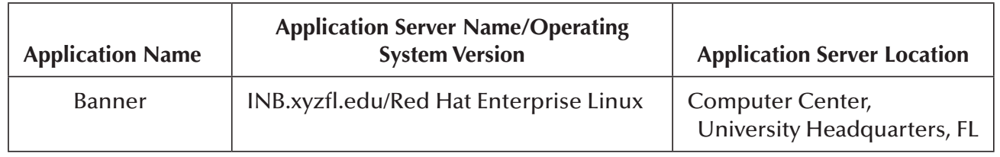

**Collection of Information Relevant for the Risk Assessment**

During the risk assessment process, relevant information is gathered via reviews and inspections of documentation, as well as on-site interviews with key management personnel:

**Key Personnel:**

- IT Executive Director (ITED)
- Banner Security Administrator (BSA)
- Operations Supervisor (OS)
- Systems Administrator (SA)
- Network Administrator (NA)

**System Overview:**

- Banner holds critical and sensitive information about finance, accounting, human resources (HR), and payroll.
- Users include finance, accounting, HR, and technical/IT support personnel.
- University provides networking resources to all qualified members within the university community.
- Policies and procedures are in place related to information systems operations, information security, and change control management.

When asked about logical information security around Banner both, the SA and BSA, agreed on the following:

- Some password settings have been configured although current configuration is not consistent with industry best practices.
- Reviews of user access within Banner are conducted, but not on a periodic basis. Terminated user accounts are removed from Banner, but not in a timely manner. Documentation supporting reviews and removal of user access is not maintained.
- Programmers are restricted to work changes and modifications (i.e., updates and upgrades) to Banner in a test/development environment prior to their implementation in production.
- Test results are not reviewed by management nor approved before final implementation in production.
- Banner information is backed up daily though the OS stated that such daily backup is stored locally as the University has no offsite facility in place for backup storage.

## **Step 2. Threat Identification**

NIST defines a threat as "any circumstance or event with the potential to adversely impact organizational operations and assets, individuals, other organizations, or the nation through an information system via unauthorized access, destruction, disclosure, or modification of information, and/or denial of service". A threat source refers to an intentional exploitation of a vulnerability, or an accidental trigger of a vulnerability.

**Threat Categories:**

- Natural threats
- Environmental threats
- Human threats

**Threat Sources:**

- Natural threats: hurricanes, earthquakes, and floods
- Environmental threats: system failures, and unexpected shutdowns
- Human threats: unauthorized access by hackers, terminated employees, and insiders (i.e., disgruntled, malicious, negligent, or dishonest employees) Motivations for human threats, as identified by management, include the following:
- Challenge, ego, and rebellion (hackers)
- Destruction of information, illegal information disclosure, monetary gains, and unauthorized data alteration (terminated employees and hackers)
- Curiosity, ego, intelligence, monetary gains, revenge, unintentional errors, and omissions (insiders)

## **Step 3. Vulnerability Identification**

NIST defines vulnerability as a "weakness in an information system, system security procedures, internal controls, or implementation that could be exploited by a threat-source" (p. 9). Vulnerabilities around Banner that could be exploited by threat-sources were identified from discussions with management personnel, observations, and inspections of relevant documentation, as recommended by NIST. Documentation reviewed include previous IT risk assessments, as well as IT Audit and Security Reports.

Refer to Exhibit A5.2 for a list of five vulnerabilities and threat-source pairs identified per IT area.

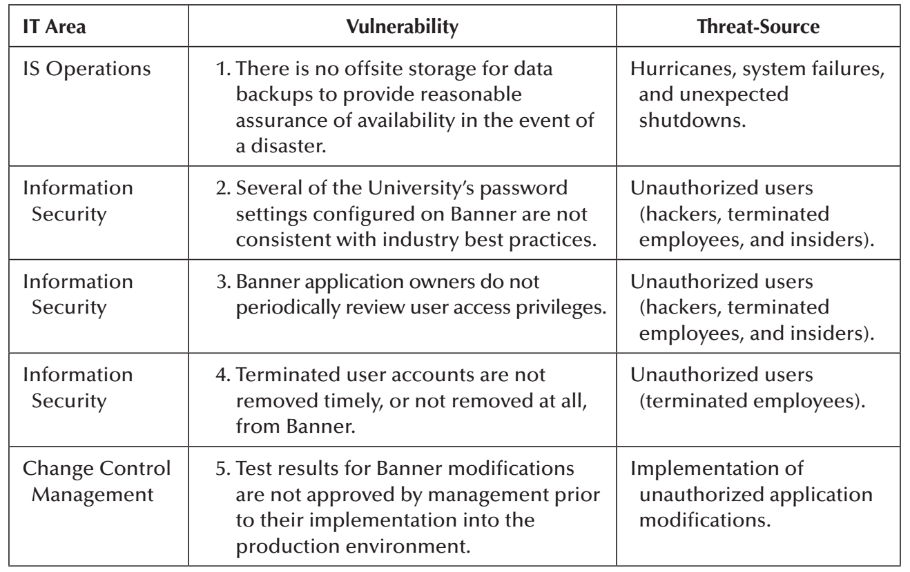

## **Step 4. Control Analysis**

This step takes into consideration the controls that are in place or are planned for implementation by the University to reduce or eliminate the probability of a threat exercising a vulnerability.

**Existing Policies & Controls**

- Users must comply with policies and guidelines, and act responsibly while using network resources.
- Physical access to the University's facilities and its data center, according to the ITED and the OS, is restricted through security mechanisms, including (1) biometric devices, (2) security guards, (3) video surveillance, and (4) visitors' logs.
- The authority to change the above physical access control mechanisms is limited to the ITED.
- The University has implemented various environmental controls to prevent damage to computer equipment, and to protect data availability, integrity, and confidentiality.
- They are as follows: fire suppression equipment (i.e., FM-200 and fire extinguishers), uninterruptible power supplies, alternate power generators, and raised floors.

## **Step 5. Likelihood Determination**

NIST states that the following must be considered to develop a rating indicating the probability that vulnerabilities may be exercised:

- Motivation and capability of threat-sources
- Nature of the vulnerability
- Existence and effectiveness of current controls

NIST recommends the following High--Medium--Low definitions to describe the likelihood that vulnerabilities could be exercised by a given threat-source. However, for this example, Very High and Very Low levels have been added to obtain a more granular rating indicating the probability that vulnerabilities may be exercised. Probabilities of Very High = 1.00, High = 0.75, Medium = 0.50, Low = 0.25, and Very Low = 0.10 were assigned for each vulnerability based on management's estimate of their likelihood level.

Refer to Exhibit A5.3.

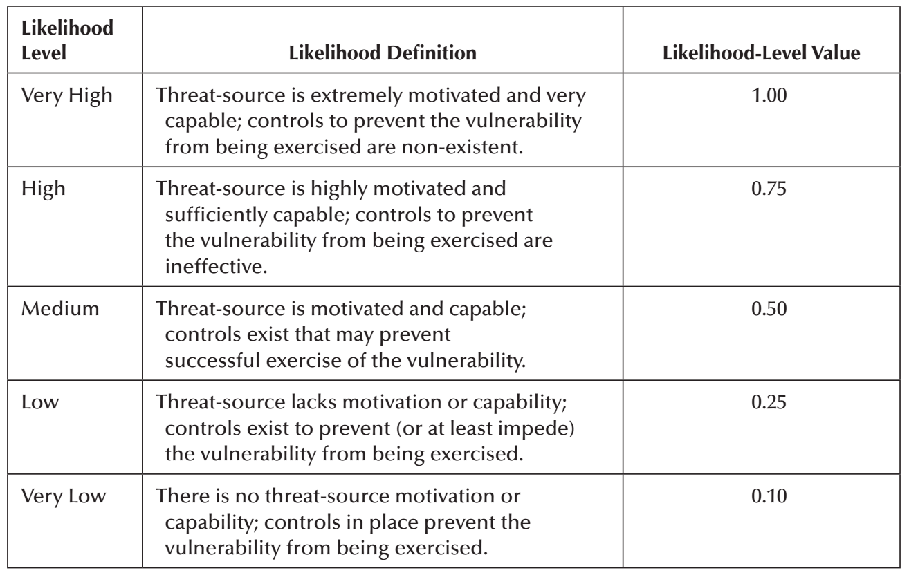

## **Step 6. Impact Analysis**

According to NIST, impact analysis determines the adverse effect in the IT system resulting from threats that successfully exercise vulnerabilities. The magnitude of the impact cannot be measured in specific units, but can be classified as High, Medium, or Low, as recommended by NIST. In this example, Very High and Very Low magnitudes were also incorporated to obtain a more detailed impact level from threats successfully exercising vulnerabilities.

Refer to Exhibit A5.4.

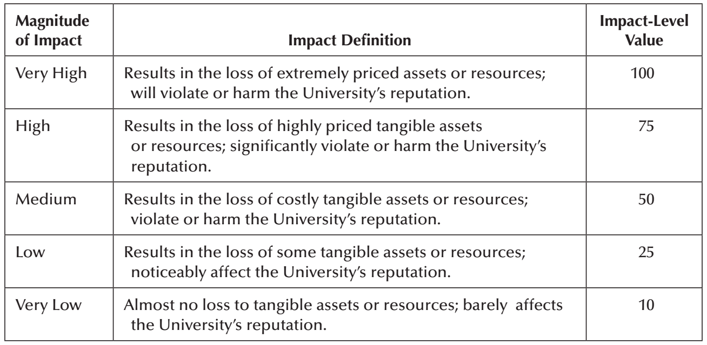

## **Step 7. Risk-Level Determination**

Determination of risk level for a particular vulnerability/threat pair that can be exercised considers:

- The likelihood of a threat-source attempting to exercise a vulnerability;
- The magnitude of the impact from a threat-source successfully exercising the vulnerability; and
- The appropriateness of planned, or existing controls for mitigating or eliminating identified risks.

Determination of risk levels (i.e., Risk Rating) is obtained by multiplying the ratings assigned for threat likelihood (i.e., probability) and the threat impact. Determination of these risk levels or ratings is of a subjective nature, as it results solely from management's estimates and opinions (based on knowledge and/or prior experience) when assigning threat likelihood and impact.

Exhibit A5.5 shows various degrees or levels of risk, based on NIST, to which an IT system (in this case Banner) might be exposed if a given vulnerability was exercised by a threat. Exhibit A5.5 also suggests necessary actions that management must take for each risk level. For purposes of this example, Very High and Very Low risk levels were incorporated to obtain granularity of risk ratings.

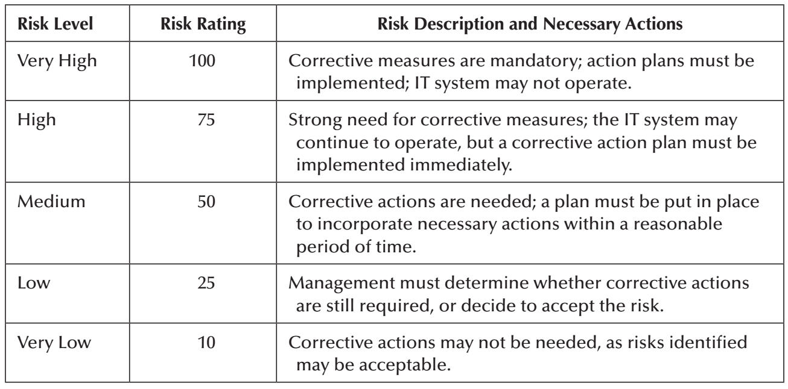

Exhibit A5.6 illustrates completion of the Steps 1--7, including a description of each risk identified, as well as final determination of their levels (i.e., risk rating) for every vulnerability that could be potentially exercised.

As mentioned earlier, Steps 4, 8, and 9 relate to the identification and implementation of controls that mitigate or reduce risks, as well as results documentation. Those steps are addressed in the following sections.

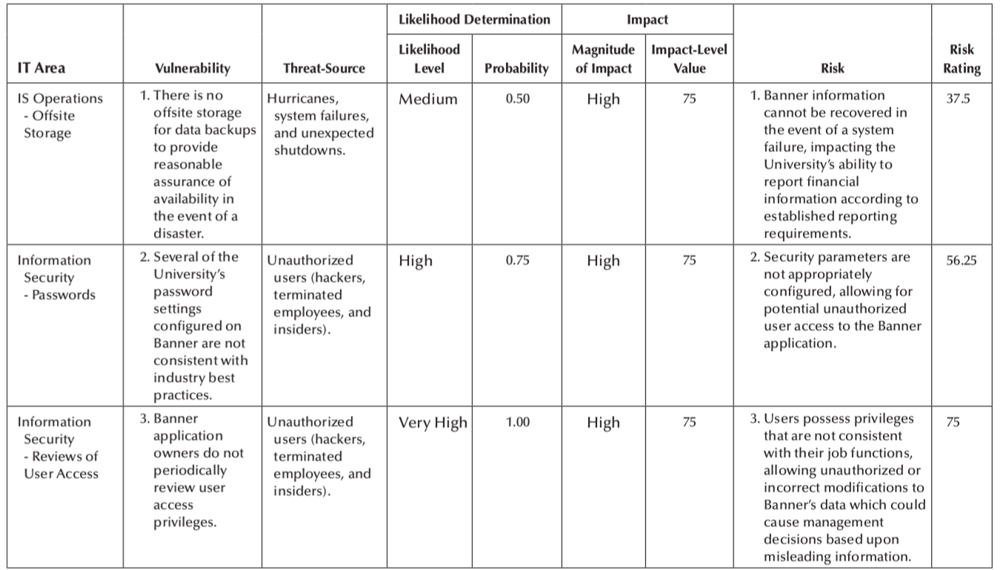

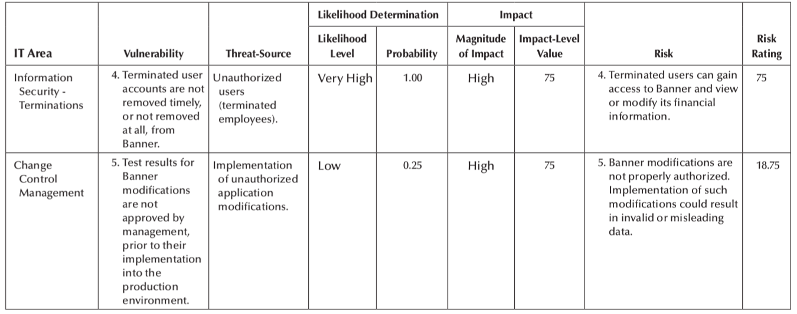

## **Step 8. Control Recommendations**

The risk mitigation process forms the second half of the risk management methodology. Per NIST, organizations' management must select a reasonable and effective cost approach to implement appropriate IT controls to reduce identified risks to acceptable levels.

Exhibit A5.7 describes the options available for risk mitigation and risk management strategy.

In conversations with University's management, it was agreed that Risk Planning was the option selected to mitigate the risks identified. Therefore, the mitigation strategy involved preparing a plan which would prioritize, implement, and maintain the necessary controls to address the risks. Management understood that it was appropriate to implement controls to address risks when vulnerabilities can be exercised by threats. That is, management's plan, following NIST, was to incorporate security and protection via implementing controls to either minimize risks or prevent them.

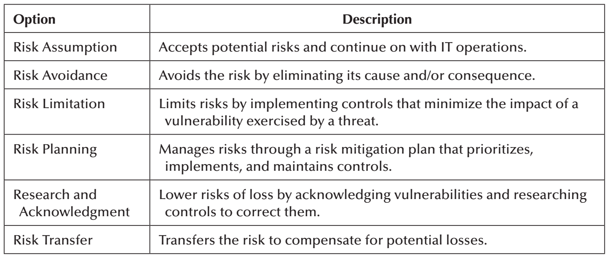

**Approach for Control Recommendation/Implementation**

To select and implement controls to address the risks, management adopted the NIST recommended approach for control implementation. The approach starts by prioritizing and evaluating recommended controls (RCs) followed by their formal selection and identification of residual risks. The NIST-recommended approach assists in implementing controls that can reduce the risks associated with Banner.

**Prioritization and Recommended Controls**

Prioritization, according to NIST, refers to the process of establishing significance to the risks identified and the RCs for mitigation. Based on the significance to the risks identified, control recommendations are established. Management listed all potential RCs that could reduce the risks identified and assigned priority to those controls using rankings ranging from Very High to Very Low levels (refer to Exhibit A5.8).

Management also acknowledged that implementing all RCs may not be the most appropriate and feasible option. Further analyses related to feasibility, effectiveness, and cost-benefit were performed in the following sections for each RC to determine the most appropriate ones for reducing risks.

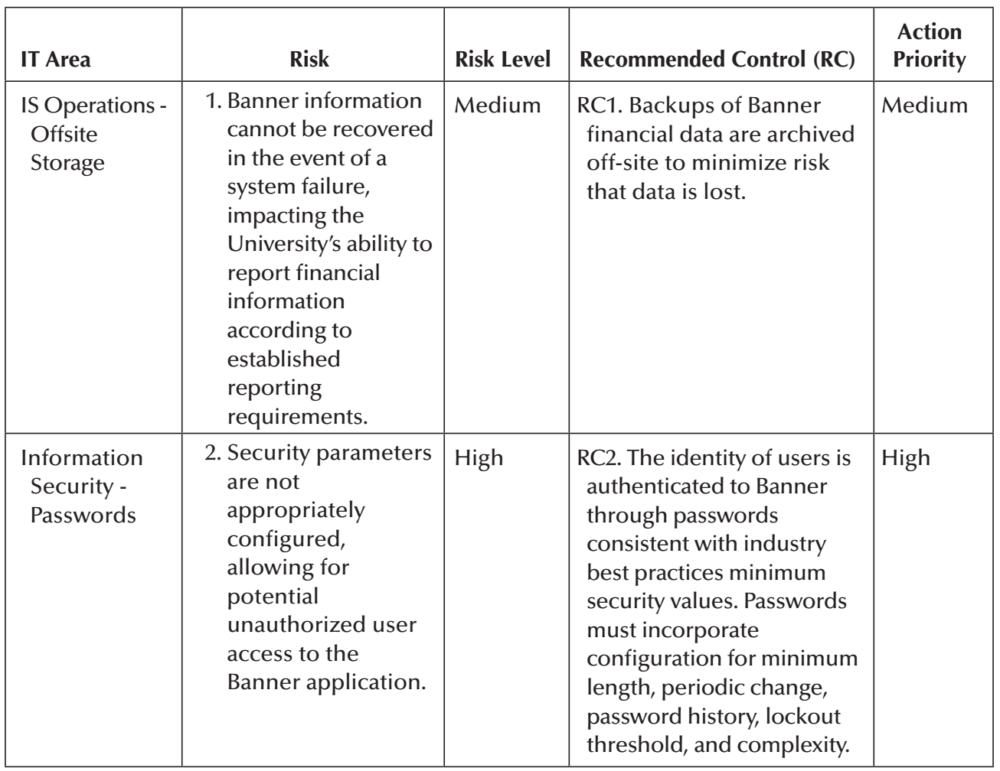

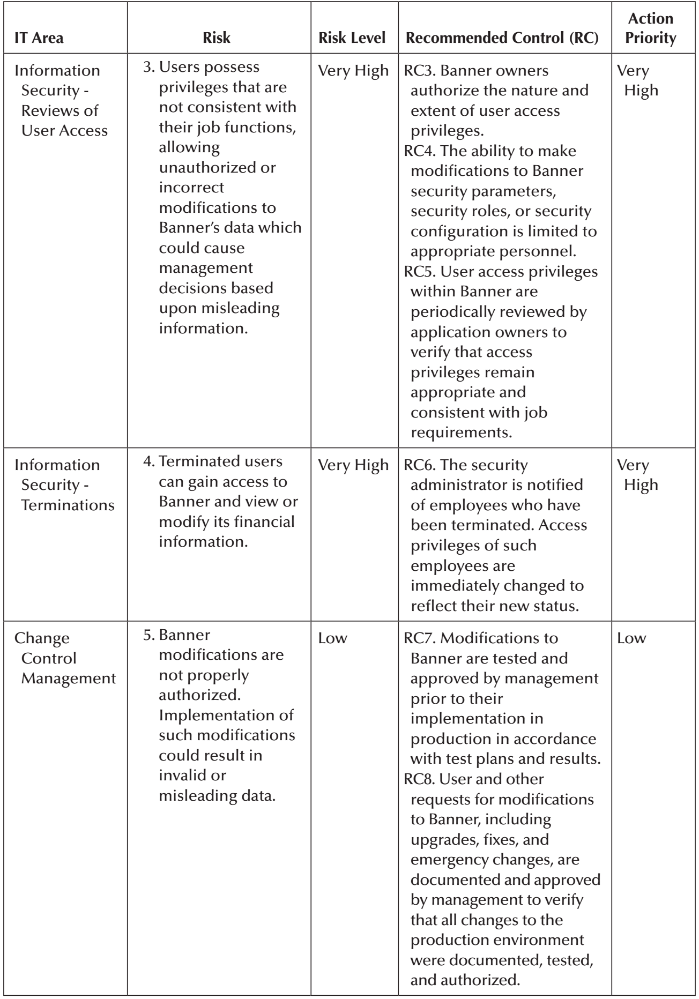

**Feasibility and Effectiveness Evaluations of Recommended Controls**

Management acknowledged that the control recommendation process involves selecting a combination of controls from technical, management, and operational categories that could potentially reduce risks around Banner. The following are descriptions of each category of control based on NIST.

- Management Security Controls. These controls manage and reduce the risk of loss while protecting the organization's mission. Management security controls take the form of policies, guidelines, and standards to fulfill the organization's goals and missions.
- Technical Security Controls. These controls relate to the configuration of parameters within applications, systems, databases, and networks to protect against security threats over critical and sensitive information, as well as IT system functions.
- Operational Security Controls. These controls make certain that security procedures governing the use of the organization's IT assets (i.e., Banner) are adequately implemented consistent with the organization's goals and mission. Operational security controls address operational deficiencies that could result from potentially exercised vulnerabilities.
- Category determination and discussions of each RC per IT area were performed with the assistance of management and are documented in Exhibit A5.9.

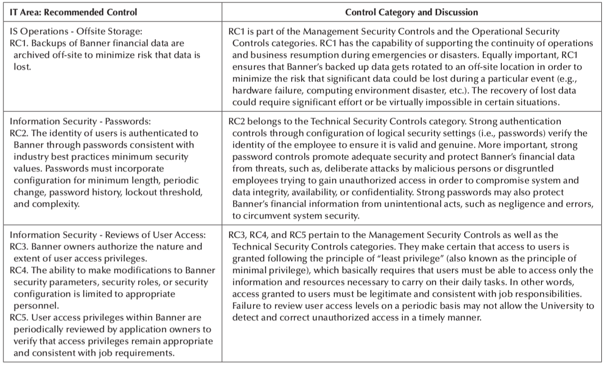

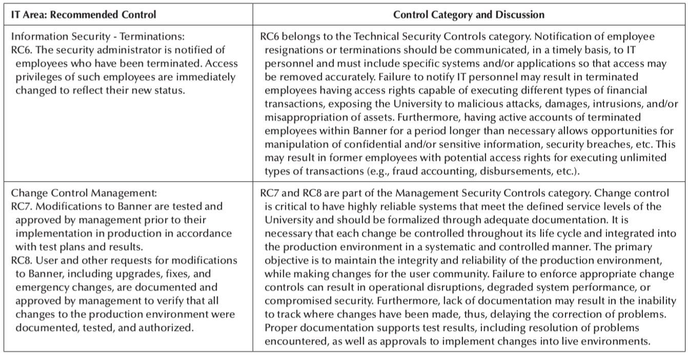

**Cost-benefit Analysis for Recommended Controls**

Cost-benefit analysis should be conducted following identification of RCs and evaluation of their feasibility and effectiveness. The objective of the cost-benefit analysis is to support that the cost of implementing the control is justified by a reduction in the level of risk. That is, cost-benefit analyses should ensure that controls are implemented in a cost-effective way. Management understood appropriate that the benefits of the selected controls must be evaluated in terms of their impact in risk reduction. Along the same line, the effect of not implementing controls needs to be assessed to support whether Banner can continue operating effectively without implementing the controls. Management must determine the minimum level of acceptability for the risks identified, as well as the impact of each selected control to determine their effect on Banner. Assessments of the potential controls in relation to the risks can be done following the rules below, as suggested by NIST:

- Rule 1. If control reduces risks more than needed, consider an alternate, less expensive control.
- Rule 2. If the cost of the control is higher than the risk reduction provided, consider identifying additional controls.
- Rule 3. If the control does not provide a significant risk reduction, consider identifying additional controls.
- Rule 4. If the control does provide a significant risk reduction and it is cost-effective, implement the control.

Below is an overall summary of the cost-benefit analysis procedures management performed for each RC:

- Assessed the impact of implementing versus not implementing the RC.
- Estimated the cost of implementation considering the following factors, as applicable:
  - Additional purchases of hardware and software required.
  - Reduced operational effectiveness resulting from no implementation.
  - Reduced system performance, functionality, or security from no implementation.
  - Cost of implementing new/revised policies, procedures, standards, etc.
  - Cost of hiring (or training) personnel to implement RCs.
- Evaluated potential benefits over costs to support implementation of the new control
- Communicated cost-benefit analysis to the University's senior management and Board of Directors.

Once the cost-benefit analysis was performed, controls were formally selected (refer to Exhibit A5.10).

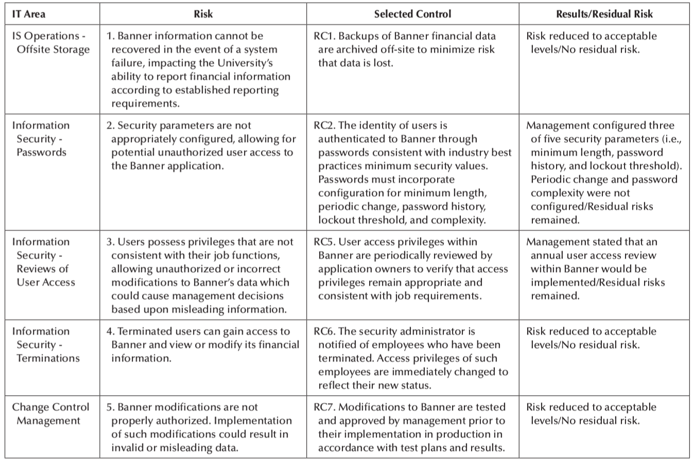

However, because risks cannot be eliminated completely, but reduced to acceptable levels, there were some risks that remained after formal selection and implementation of the controls. These remaining risks are called "residual risks" and are discussed next.

**Residual Risk Overview**

NIST states that no IT system, including its systems and applications, is risk free. Although implemented controls can mitigate or reduce risks, they simply cannot eliminate all risks. Any risk remaining after implementation of new or enhanced controls is referred to as a residual risk. NIST also states that reductions in risks resulting from new or enhanced controls can be analyzed by organizations in terms of the reduced threat likelihood or impact, as these two parameters define the mitigated level of risk to the organizational.

NIST further suggests that implementation of new or enhanced controls can mitigate risks by:

- eliminating vulnerabilities through minimizing possible threat-source/vulnerability pairs;

- adding targeted controls to reduce capacities and motivations of threat-sources; and by

- reducing the magnitude of the adverse impact through limiting the extent of vulnerabilities.

Exhibit A5.11 illustrates the relationship between control implementation and residual risk.

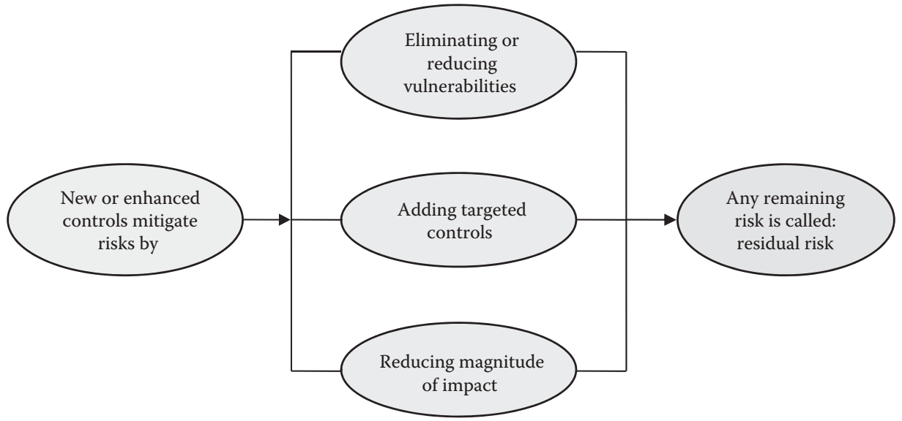

Step 9 describes the results of this risk assessment, including the residual risks remaining in Banner after mitigation has been applied, as well as a plan for managing such residual risks.

## **Step 9. Results Documentation**

As indicated above, implemented controls may lower risks, but not necessarily eliminate them. Residual risks may remain after all other known risks have been countered, factored, or reduced, exposing the organization to loss.

Exhibit A5.10 shows the effect from implementing controls over the risks identified, as indicated by management. The following summarizes such effect once the selected controls were implemented:

Risk 1, Risk 4, and Risk 5 related to recovery of Banner data, access of terminated user accounts, and unauthorized implementation of Banner changes, respectively, were reduced to acceptable levels with no remaining residual risks. No further procedures were deemed necessary.

Risk 2, related to configuration of inappropriate security parameters (i.e., passwords), as well as Risk 3 (i.e., inconsistencies in user access) was not reduced to acceptable levels resulting in some residual risks remaining, which are discussed below.

For Risk 2, management configured three out of five password parameters (i.e., minimum length, password history, and lockout threshold). However, periodic password change and complexity settings were not configured. Management acknowledges that periodic password change (or password expiration) and complexity may be a source of frustration to users, who are often required to create and remember new passwords every few months for various accounts. Therefore, users tend to choose weak passwords and use the same few passwords for many accounts. Management further stated that the costs for configuring these two password settings were not justifiable. As a result, a residual risk remained still exposing Banner financial data to threats like malicious attacks, damages, intrusions, and/or manipulation.

After several discussions regarding the residual risks, management expressed interest over improving current Banner password settings soon. In the meantime, the following constitutes management's plan and current safeguards to manage and/or mitigate the residual risks related to Risk 2:

- Current password settings configured at the local area network (LAN) are consistent with industry best practices and address settings such as minimum length, password history, lockout threshold, password change, and complexity. This current control helps managing and mitigating the residual risk in Banner, as users need to authenticate to the LAN before accessing the Banner application. The LAN serves as the first level of authentication for Banner users, and those settings are effectively configured.
- Information security tools over Banner are administrated and implemented to restrict access, as well as record and report security events (e.g., security violation reports, unauthorized attempts to access information resources, etc.).
- Banner application owners authorize access for new users and/or users that have changed roles and responsibilities.
- Banner users are required to have a unique user identifier to distinguish one user from another and to establish accountability.
- Banner terminals and workstations are protected by time-out facilities, which are activated after an appropriate, predetermined period of inactivity has elapsed.

Regarding Risk 3, management stated that only one user access review would continue to be performed during the year as the cost for performing additional/periodic reviews of user access is not justifiable. As a result, the following residual risks remained as acknowledged by management:

1.  Lack of periodic reviews of user access levels may result in employees having access rights to record and authorize different types of transactions (e.g., accounting transactions, journal entries, etc.), thus, exposing the University to a risk of fraud, manipulation of information, or misappropriation and errors.
2.  Failure to review user access levels on a periodic basis may not allow the University to detect and correct unauthorized access in a timely manner.

To come up with a plan to identify safeguards to manage and/or mitigate such residual risks, management pointed to the following procedures which were currently in place:

- Banner application owners authorize access for new users and/or users that have changed roles and responsibilities.
- The ability to make modifications to Banner security parameters, security roles, or security configuration is limited to appropriate personnel.
- Information security tools over Banner are administrated and implemented to restrict access, as well as record and report security events (e.g., security violation reports, unauthorized attempts to access information resources, etc.).
- There are effective procedures in place to ensure that production systems are available for the execution of processing and that financial data can be recovered should any disruptions in processing occur.
- There are effective change control procedures to ensure that Banner modifications are tested in separate test/development environment before implementation into the production environment.

Management further expressed their intention to segregate Banner users in groups. A schedule will be prepared to conduct additional, periodic reviews of access for several groups of users during the year. Access of all these groups of users must be reviewed and approved during a period of two years. Documentation supporting those reviews will also be maintained as evidence.

The control activities are helpful in managing and mitigating the residual risks resulting from password settings, as well as the lack of periodic user access reviews. These additional safeguards compensate the exceptions previously noted and can mitigate the risks of unauthorized users gaining access to Banner financial data. Overall, results of this risk assessment exercise were satisfactory, meaning that IT controls are functioning effectively. That is, controls in place not only mitigate risks, but cover effectiveness and efficiency of operations, reliability and completeness of accounting records, and compliance with applicable laws and regulations, among others.

## **Conclusion**

Management expressed great satisfaction with the results of both, risk assessment and mitigation exercises, and further indicated that the results obtained around the Banner financial application were consistent with previous risk assessments and evaluations. Particularly, the results of the risk exercises performed motivated the University's IT management to continue providing users safe and reliable financial information by constantly protecting the information's confidentiality, integrity, and availability through effective IT controls.

# References

NIST. (2012). Guide for Conducting Risk Assessments. *Special Publication 800-30 Revision 1*. Retrieved from https://csrc.nist.gov/publications/detail/sp/800-30/rev-1/final

Otero, A. R. (2019). *Information Technology Control and Audit* (5th ed.). Boca Raton, FL, US: Taylor & Francis Group.

<!-- Body (End) -->

<!-- Footer (Start) -->

# Author

### Aaron Martinez

- GitHub: <https://github.com/martinezcode/>
- LinkedIn: <https://www.linkedin.com/in/martinezcode/>

<!-- Footer (End) -->