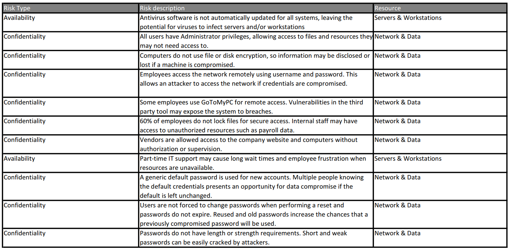
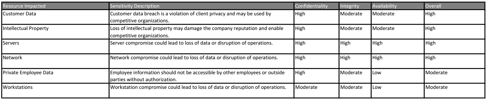
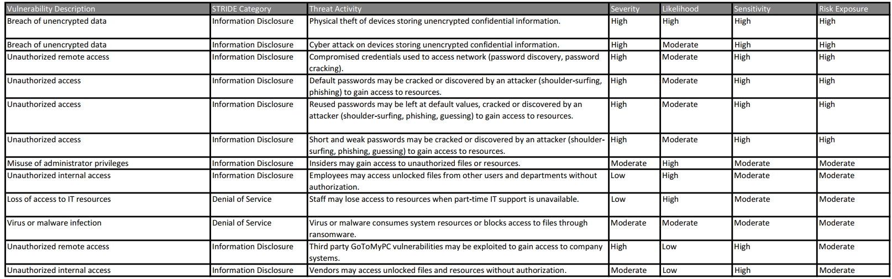
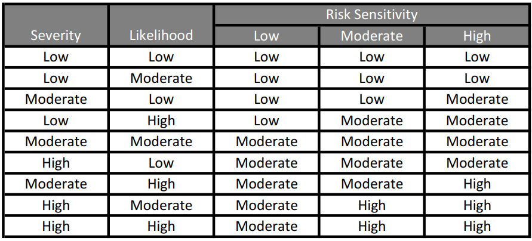
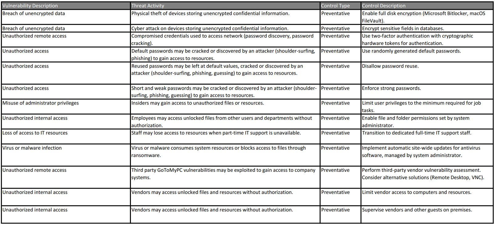

<!-- Header (Start) -->

# Project Based Risk Management Framework

## Facilitated Risk Analysis & Assessment Process (FRAAP) - Analysis & Assessment

### NPS Public Relations & Marketing ­Case Study: FRAAP Analysis & Assessment

<!-- Header (End) -->

**Overview**

The *CYBR 610 Case Study #3 -- NPS Public Relations & Marketing* from Bellevue University (2013) outlined the information technology (IT) infrastructure for the fictional NPS Public Relations Marketing Firm. The organization has experienced recent security breaches, and a risk management analysis is completed to assess their security risk and provide recommend mitigation controls. The assessment was conducted using the Facilitated Risk Analysis and Assessment Process (FRAAP) framework. As noted by Wheeler (2011), the FRAAP method is a strong methodology for the one-time assessment conducted in a short time-frame requested in the case study. A risk mitigation was developed using FRAAP worksheets, to enable NPS to determine an acceptable level of risk, assess current level of risk, reduce risk to the acceptable level, and maintain the acceptable level of risk.

Following the FRAAP method, a one-time assessment session was conducted to identify issues and risks, analyze potential impacts, and determine likely consequences of the risks. A series of worksheets were used to capture and prioritize the issues and risks discussed. Outputs of the FRAAP analysis consist of the identification of risks and concerns, the identification of threats, and the recommendations for controls to mitigate threats (Wheeler, 2011).

**Identification of Risks**

The Risk Description List worksheet (Figure 1) captured the identified risks and assigned a risk type of Confidentiality, Integrity, or Availability (CIA). The affected resources are also included. The CIA sensitivities for primary resources are rated using a Low-Moderate-High scale in the Resource Sensitivity Profile Worksheet (Figure 2).

###### Figure 1. Risk Description List FRAAP worksheet.

###### Figure 2. Resource Sensitivity Profile FRAAP worksheet.

**Identification of Threats**

The identified risks are broken into threat/vulnerability pairs in the Risk Exposure Rating worksheet (Figure 3). Threat categories are assigned based on STRIDE classification: Spoofing, Tampering, Information Disclosure, Repudiation, Denial of Service, Elevation of Privileges (Kohnfelder & Garg, 1999). A single initial risk may be separated into multiple combinations of threat/vulnerability pairs with different risk ratings (Wheeler, 2011). The likelihood and severity are combined with the sensitivity of the resource, and a qualitative mapping table (Figure 4) is used to derive a final exposure rating. As proposed by Wheeler (2011), documented occurrences of the vulnerability having been previously exploited elevates the estimated likelihood level.

###### Figure 3. Risk Exposure Rating FRAAP worksheet.

###### Figure 4. Qualitative Mapping Table.

**Recommendations for Mitigating Controls**

Mitigating controls are identified and listed in the Mitigating Controls List worksheet (Figure 5). The controls are assigned a type of Preventative, Detective, or Responsive, as suggested by Wheeler (2011). Cost-effective solutions are favored, and the total cost of any control should be proportional to the resource value (Wheeler, 2011). When possible, controls that address multiple risks are recommended, but multiple controls may be needed to mitigate a single risk in some cases.

###### Figure 5. Mitigating Controls List FRAAP worksheet.

**Conclusion**

The FRAAP framework provided a structured & streamlined approach for an accelerated assessment of the risks presented in the NPS case study. The standard worksheets shortened the time needed to gather risk data and produce recommendations, while providing the flexibility to meet the needs of the organization.

# References

Bellevue University. (2013). CYBR 610 Case Study #3 -- NPS Public Relations & Marketing. Retrieved from
http://content.bellevue.edu/cst/cybr/610/pa/case-3/

Kohnfelder, L., & Garg, P. (1999, April 1). The threats to our products. Retrieved from
https://adam.shostack.org/microsoft/The-Threats-To-Our-Products.docx

Wheeler, E. (2011). Security Risk Management: Building an Information Security Risk Management Program from the Ground Up. Waltham, MA: Elsevier.

<!-- Footer (Start) -->

# Author

### Aaron Martinez

- GitHub: <https://github.com/martinezcode/>
- LinkedIn: <https://www.linkedin.com/in/martinezcode/>

<!-- Footer (End) -->

