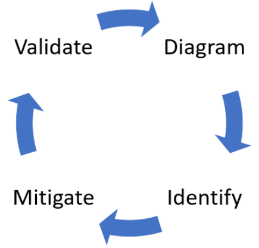
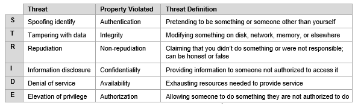
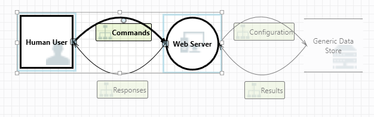
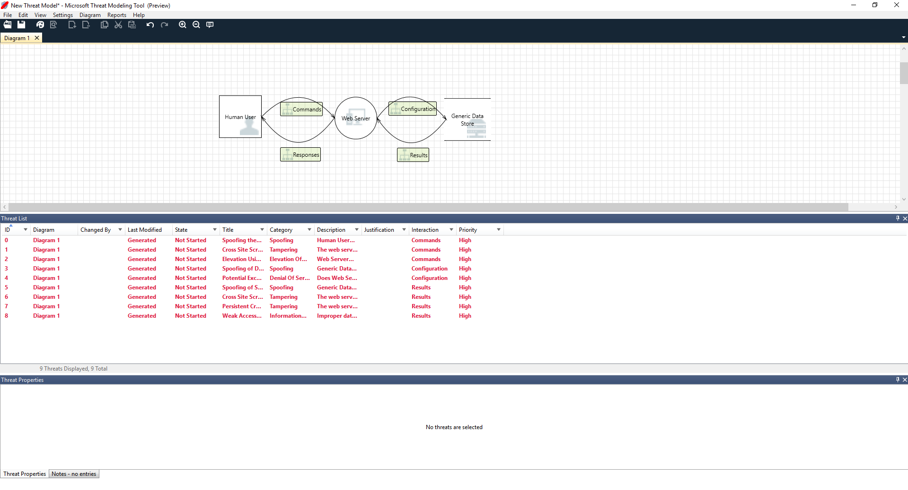
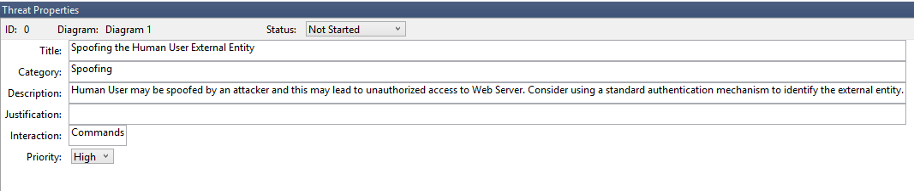

<!-- Header (Start) -->

# Threat Modeling Framework

## Implementation Guide

### STRIDE-based implementation of the Microsoft Security Development Lifecycle (SDL)

<!-- Header (End) -->

**Introduction**

With heavy reliance on information technology (IT) infrastructure in modern society, individuals and organizations must consider threats against the software, IT systems, physical systems, and processes that support their digital lives. Recent technologies such as high-speed wireless networks, smartphones, and Internet of Things (IoT) devices have introduced new attack vectors that can cross the bridge between the virtual cyberspace environment and the physical world. Fortunately, regardless of the type of system being considered, mitigations can be developed using threat modeling to identify vulnerabilities.

To aid individuals, teams, and organizations with this effort, a flexible threat modeling process was developed following the Microsoft Security Development Lifecycle (SDL) approach consisting of four steps:

- Diagram
- Identify
- Mitigate
- Validate

The process incorporates the  STRIDE model for identifying threats against system entities, events, and boundaries across a generalized set of common threats:

- **S**poofing
- **T**ampering
- **R**epudiation
- **I**nformation Disclosure
- **D**enial of Service
- **E**levation of Privileges

**General Threat Modeling Process**

The general threat modeling process consists of creating a diagram, identifying threats, mitigating the threats, and validating each mitigation as illustrated in Figure 1. The  STRIDE identification method supports this SDL approach by providing a consistent and predictable set of threat categories that can be applied to many different types of systems. Table 1 outlines the types of threats that can be identified using the  STRIDE mnemonic.

###### *Figure 1. Threat modeling process flow based on SDL (Microsoft, 2017).*

###### *Table 1. STRIDE model for threat identification (Shevchenko, 2018).*

**Diagram**

The Diagram step seeks to answer the question: **What are we building or protecting?**

To model a system, the process must include consideration of any unique organizational or security goals, through documentation of both logical and physical system information. This step may require gathering any external or internal policies, standards, and procedures that are applicable to the system. Based on gathered information, a data flow diagram (DFD) can be drawn to represent aspects of the system, including:

- Processes (Applications, browser plug-ins, threads, virtual machines)
- External Interactors (Authentication providers, browsers, users, web applications)
- Data Stores (Cache, storage, configuration files, databases, registry)
- Data Flows (Binary, ALPC, HTTPS/TLS/SSL, IPsec, ...)
- Trust Boundaries (Corporate networks, internet, machine, sandbox, user/kernel mode)

An effective DFD can be created using a whiteboard or cocktail napkin, but software tools are also available for diagramming. The Microsoft Threat Modeling Tool software application provides a simple interface for creating diagrams and includes several features that can be used in later steps. The DFD drawn in Figure 2 shows a basic interaction between a human user (square box), a web server (circle), and a database (two-sided box).

###### Figure 2: System data flow diagram drawn in Microsoft Threat Modeling Tool (Microsoft, 2017)

**Identify**

The Identify step seeks to answer the question: ***What can go wrong?***

Answering this question involves identifying credible sources of threat and vulnerability information, gathering, analyzing, and storing that information, and then evaluating threats and vulnerabilities to determine whether they apply to the information system. The  STRIDE model simplifies this process by providing a quick reference for the most common types of credible threats. The Microsoft Threat Modeling Tool can perform automatic  STRIDE identification using its Analysis View feature, which auto-generates a basic Threat List for elements of the DFD and can display additional information in the Threat Properties window, as shown in Figure 3.

###### Figure 3: Threat List in Microsoft Threat Modeling Tool (Microsoft, 2017)

**Mitigate**

The Mitigate step seeks to answer the questions: ***What should we do about it?/What are we going to do about it?***

Shostack (2014) observed the four actions that can be taken against each threat, memorable by the acronym META:

- **M**itigate
- **E**liminate
- **T**ransfer
- **A**ccept

Threats can often be eliminated by sacrificing features or transferred by passing on risk to another system. In some cases, addressing a threat may be infeasible, and the risk must be accepted. In most cases, however, mitigation through implementation of security controls is the most appropriate response. As mitigations are considered and implemented, they can be tracked in Microsoft Threat Modeling Tool through fields for assigning a priority and mitigation status to each threat, as shown in the Threat Properties window in Figure 4.

###### Figure 4: Threat Properties window in Microsoft Threat Modeling Tool (Microsoft, 2017)

**Validate**

The Validate step seeks to answer the question: ***Did we do a good job?***

The threat model can be validated by evaluating the impact of controls to the system. Shostack (2014) recommended:

- **Checking the Model** - *Ensure that model matches the actual system.*
  - Is it complete?
  - Is it accurate?
  - Does it cover all security decisions made?
  - Can I start a new threat modeling iteration without changing the diagram?
- **Updating the Diagram** - *Identify any information missing from the diagram.*
  - Focus on data flow, not control flow.
  - Add more detail for "sometimes" or "also" cases.
  - Draw in anything that requires more detail for explanation of security-relevant behavior.
  - Draw in agreed-upon facts that resulted from design discussions.
  - Avoid data sinks that don't show how a data store is used.
  - Show processes that move data.
  - The diagram should support interaction storytelling.
  - Don't include too much detail.
- **Checking Each Threat** - *Check that each threat was handled appropriately and that as many threats as possible were found.*
  - Did I do something with each unique threat?
  - Did I do the *right* something with each threat?
- **Checking Your Tests** - *Ensure a good detection test is built for each threat.*
  - Use manual or automated tests.
  - Are security tests in line with other software tests and the sorts of risks that failures expose?

**Conclusion**

The Security Development Lifecycle and  STRIDE based threat modeling process provides a starting point for generating a list of real and potential threats that can be used to determine mitigation methods. As indicated by the process flow diagram in Figure 1, the threat modeling process is iterative. Each step leads to the next, and the entire process begins again after each step has been completed. Repeating the process allows for refinement of the diagram, threat list, mitigating controls, and validation tests, while also helping the stakeholders participating in threat modeling develop their skills. Over time, the models will improve, analysis will improve, and system security will improve. The **Diagram**, **Identify**, **Mitigate**, and **Validate** threat modeling process is a flexible method for effectively finding threats in the wide variety of systems that individuals and organizations rely on.

# References

Kohnfelder, L., & Garg, P. (1999, April 1). The threats to our products. Retrieved from
https://adam.shostack.org/microsoft/The-Threats-To-Our-Products.docx

Microsoft. (2017, August 17). Getting started with the Threat Modeling Tool. *Azure Security Documentation*. Retrieved from
https://docs.microsoft.com/en-us/azure/security/develop/threat-modeling-tool-getting-started

Shevchenko, N. (2018, December 3). Threat Modeling: 12 Available Methods. *Carnegie Mellon University*.  Retrieved from
https://insights.sei.cmu.edu/sei_blog/2018/12/threat-modeling-12-available-methods.html

Shostack, A. (2014). *Threat Modeling, Designing for Security.* Wiley Publishing.

<!-- Footer (Start) -->

# Author

### Aaron Martinez

- GitHub: <https://github.com/martinezcode/>
- LinkedIn: <https://www.linkedin.com/in/martinezcode/>

<!-- Footer (End) -->
